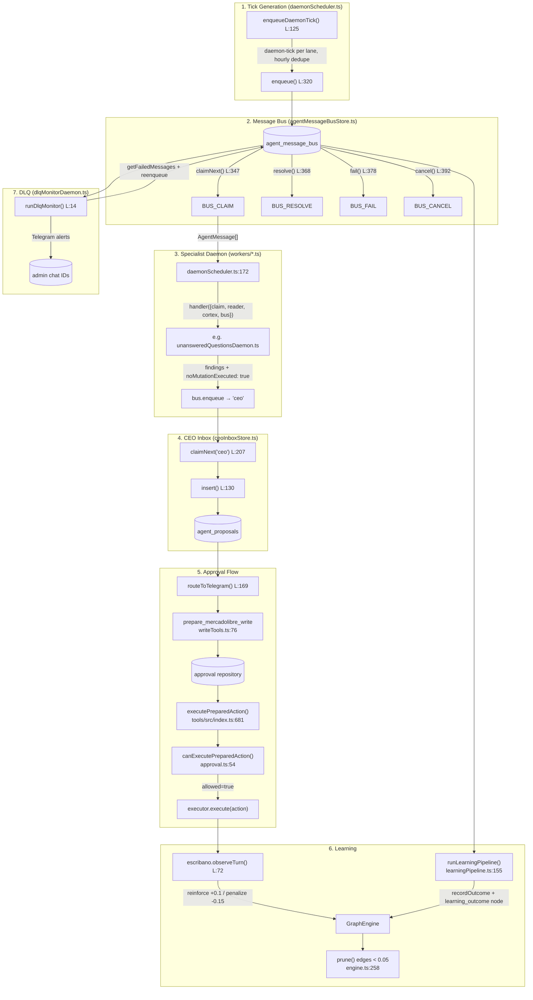

# Agent Brain Runtime Audit — July 2026

**Branch**: `audit/agent-brain-runtime-map`
**Date**: 2026-07-09
**Base commit**: `b5a211c` — `feat(runtime): wire production providers and secrets readiness (#122)`
**Auditor**: Staff Engineer — automated SDD exploration

---

## 1. Executive Summary

The Msl agent runtime brain is **operational with verified end-to-end flows** from daemon tick through CEO proposal to approval-gated execution. All 15 declared agents have lane contracts, 14 have active daemon handlers registered in the scheduler, and the 15th (CEO) intentionally acts as a proposal sink. The connection graph is verified at code level for all 7 stages. MercadoLibre safety is solid — no production write can execute without explicit human approval, zero real API calls exist in test suites, and no secrets are hardcoded.

**Critical gaps found**: (1) strategic memory stores (Cortex, strategies, autonomy, agent_lessons) lack `seller_id` scoping — Plasticov and Maustian share a single strategic brain. (2) `OwnedEcommerceStore` uses risky DROP+CREATE migration pattern without explicit transactions. (3) `evidence_request` message routing has no messageType filtering — evidence requests go to daemon handlers that expect `daemon-tick` messages. (4) No dedicated tests exist for `ownedEcommerceDaemon`, `systemHealthDaemon`, or `dlqMonitorDaemon`.

---

## 2. Overall Status

| Area                                | Status      | Detail                                                                             |
| ----------------------------------- | ----------- | ---------------------------------------------------------------------------------- |
| Agent declarations & lane contracts | ✅ COMPLETO | 15 LaneId members, all with LANE_CONTRACTS                                         |
| Daemon handlers & scheduler         | ✅ COMPLETO | 14 registered, 14 handler files, 0 disconnected                                    |
| Agent message bus                   | ✅ COMPLETO | Full lifecycle: enqueue → claim → resolve/fail/cancel → DLQ                        |
| CEO proposal ingestion              | ✅ COMPLETO | CeoInboxStore with Telegram routing                                                |
| Approval queue                      | ✅ COMPLETO | PreparedAction → approval → execution gate                                         |
| MercadoLibre safety                 | ✅ COMPLETO | 5-layer approval enforcement, 0 real writes in tests                               |
| Connection flow (tick→outcome)      | ✅ COMPLETO | 7 steps verified with file:line evidence                                           |
| Cortex / learning                   | 🟡 PARCIAL  | Active but partially event-driven, no seller scope, no manual deletion             |
| Memory stores                       | 🟡 PARCIAL  | 22 stores mapped; strategic stores lack seller_id; owned-ecommerce migration risky |
| Integration tests                   | 🟡 PARCIAL  | 9/10 scenarios exist; scenario #4 (approval→executor→outcome) missing              |
| Daemon coverage                     | 🟡 PARCIAL  | 3 daemons lack dedicated unit tests                                                |

---

## 3. Agent Map

| #   | Agent                  | LaneId                          | Handler                                  | Scheduler | Cortex | DeepSeek    | Proposals          | Writes                     |
| --- | ---------------------- | ------------------------------- | ---------------------------------------- | --------- | ------ | ----------- | ------------------ | -------------------------- |
| 1   | CEO/Socio              | `ceo`                           | N/A (sink)                               | N/A       | N/A    | N/A         | Receives           | NO                         |
| 2   | Cost/Supplier          | `cost-supplier`                 | ✅ `costSupplierDaemon.ts:35`            | ✅ L:80   | ✅     | ✅ optional | YES → ceo          | NO                         |
| 3   | Market/Catalog         | `market-catalog`                | ✅ `marketCatalogDaemon.ts:32`           | ✅ L:78   | ✅     | ✅ optional | YES → ceo          | NO                         |
| 4   | Creative Assets        | `creative-assets`               | ✅ `creativeAssetsDaemon.ts:42`          | ✅ L:81   | ✅     | ✅ optional | YES → ceo          | NO                         |
| 5   | Creative Commercial    | `creative-commercial`           | ✅ `creativeCommercialDaemon.ts:33`      | ✅ L:82   | ✅     | ✅ optional | YES → ceo          | NO                         |
| 6   | Creative Studio        | `creative-studio`               | ✅ `creativeStudioDaemon.ts:115`         | ✅ L:83   | ✅     | NO          | YES → ceo          | YES (MiniMax, local files) |
| 7   | Operations Mgr         | `operations-manager`            | ✅ `operationsManagerDaemon.ts:30`       | ✅ L:79   | ✅     | ✅ optional | YES → ceo          | NO                         |
| 8   | Owned Ecommerce        | `owned-ecommerce`               | ✅ `ownedEcommerceDaemon.ts:32`          | ✅ L:88   | NO     | NO          | YES → ceo          | NO                         |
| 9   | Product Ads Monitor    | `product-ads-monitor`           | ✅ `productAdsMonitorDaemon.ts:53`       | ✅ L:84   | ✅     | NO          | YES → ceo          | NO                         |
| 10  | Product Ads CEO Profit | `product-ads-ceo-profitability` | ✅ `ceoProfitabilityHandler.ts:218`      | ✅ L:85   | ✅     | ✅ separate | Telegram + actions | YES (Telegram, approvals)  |
| 11  | Product Ads Profit     | `product-ads-profitability`     | ✅ `productAdsProfitabilityDaemon.ts:40` | ✅ L:86   | ✅     | NO          | → ceo-profit       | NO                         |
| 12  | Supplier Manager       | `supplier-manager`              | ✅ `supplierManagerDaemon.ts:54`         | ✅ L:87   | ✅     | ✅ optional | YES → ceo          | YES (ledger writes)        |
| 13  | Morning Report         | `morning-report`                | ✅ `morningReportDaemon.ts:9`            | ✅ L:88   | ✅     | NO          | YES → ceo          | NO                         |
| 14  | EOD Summary            | `eod-summary`                   | ✅ `eodSummaryDaemon.ts:9`               | ✅ L:89   | ✅     | NO          | YES → ceo          | NO                         |
| 15  | Unanswered Qs          | `unanswered-questions`          | ✅ `unansweredQuestionsDaemon.ts:35`     | ✅ L:91   | NO     | NO          | YES → ceo          | NO                         |

**Standalone monitors (not in daemonHandlerMap):**

| Name          | Function                                              | Trigger                                        | Frequency |
| ------------- | ----------------------------------------------------- | ---------------------------------------------- | --------- |
| System Health | `runSystemHealthCheck()` (`systemHealthDaemon.ts:19`) | `setInterval` in `start-agent-daemons.mjs:214` | 30 min    |
| DLQ Monitor   | `runDlqMonitor()` (`dlqMonitorDaemon.ts:14`)          | `setInterval` in `start-agent-daemons.mjs:232` | 15 min    |

### Anomalies

| Category       | Count | Detail                                                           |
| -------------- | ----- | ---------------------------------------------------------------- |
| INCOMPLETO     | 0     | All LaneIds with handlers have handler files                     |
| DESCONECTADO   | 1     | `ceo` — intentionally no handler (proposal sink)                 |
| LOOP ABIERTO   | 0     | product-ads-profitability → ceo-profitability pipeline is closed |
| MEMORIA MUERTA | 0     | All write paths have corresponding read paths verified           |

---

## 4. Connection Map

### Verified end-to-end flow:

```
Daemon Tick → AgentMessageBus → Specialist Handler → CEO Proposal → CeoInboxStore → Approval Queue → Executor → Outcome → Cortex + Learning Pipeline
```

| Step                 | From (file:line)                                | To (file:line)                                            | Data                                                           | Status      |
| -------------------- | ----------------------------------------------- | --------------------------------------------------------- | -------------------------------------------------------------- | ----------- |
| Tick → Bus           | `daemonScheduler.ts:155` enqueueDaemonTick      | `agentMessageBusStore.ts:320` enqueue                     | `{cycleTimestamp}` per lane, hourly dedupe                     | ✅ VERIFIED |
| Bus → Handler        | `agentMessageBusStore.ts:347` claimNext         | `daemonScheduler.ts:172` claimNext(laneId)                | AgentMessage[] claimed to processing                           | ✅ VERIFIED |
| Handler → Proposal   | Handler e.g. `unansweredQuestionsDaemon.ts:136` | `agentMessageBusStore.ts:320` enqueue (receiver="ceo")    | `{messageType: "proposal", findings, noMutationExecuted:true}` | ✅ VERIFIED |
| Proposal → Inbox     | `daemonScheduler.ts:207` claimNext("ceo")       | `ceoInboxStore.ts:130` insert                             | `{sender_agent_id, payload_json, risk_level, seller_id}`       | ✅ VERIFIED |
| Inbox → Approval     | `ceoInboxStore.ts:169` routeToTelegram          | `writeTools.ts:76` prepare_mercadolibre_write             | PreparedAction with id, sellerId, exactChange                  | ✅ VERIFIED |
| Approval → Execution | `tools/src/index.ts:681` executePreparedAction  | `approval.ts:54` canExecutePreparedAction                 | `{allowed: boolean}` gate → executor.execute                   | ✅ VERIFIED |
| Execution → Outcome  | `agentLoop.ts:965` escribano.observeTurn        | `escribano.ts:72` + `engine.ts:115/134`                   | Hebbian reinforce +0.1 / penalize -0.15                        | ✅ VERIFIED |
| Outcome → Learning   | `learningPipeline.ts:155` runLearningPipeline   | `agentMessageBusStore.ts:443` recordOutcome + Cortex node | outcomeScore, summary, learning_outcome node                   | ✅ VERIFIED |
| DLQ Recovery         | `dlqMonitorDaemon.ts:23`                        | `agentMessageBusStore.ts:412` reenqueueFailed             | Failed → pending, attempts=0                                   | ✅ VERIFIED |

### Mermaid Diagram



---

## 5. Memory Map

### Stores Inventory

| #   | Store                         | File                                                      | Type                 | Who Writes                                   | Who Reads                                  | Persistent | Tests                                   | Risk     |
| --- | ----------------------------- | --------------------------------------------------------- | -------------------- | -------------------------------------------- | ------------------------------------------ | ---------- | --------------------------------------- | -------- |
| 1   | Cortex/GraphEngine            | `memory/src/cortex/engine.ts`                             | SQLite               | agentLoop, learningPipeline, probeDetector   | agentLoop, MCP tools, CEO advisors         | ✅         | `engine.test.ts`                        | HIGH     |
| 2   | SupplierMirrorStore           | `memory/src/supplierMirrorStore.ts`                       | SQLite               | supplierManagerDaemon, supplierMirrorRuntime | supplierMirrorDeepSeekAdvisor              | ✅         | `memory.test.ts` (partial)              | CRITICAL |
| 3   | OperationalReadModel          | `memory/src/operationalReadModel.ts`                      | SQLite               | backgroundIngestion                          | agentLoop, all daemons                     | ✅         | `operationalReadModel.test.ts`          | HIGH     |
| 4   | OwnedEcommerceStore           | `memory/src/ownedEcommerceStore.ts`                       | SQLite               | ownedEcommerceDaemon, ownedEcommerceExecutor | same                                       | ✅         | NONE                                    | HIGH     |
| 5   | AgentMessageBusStore          | `agent/src/conversation/agentMessageBusStore.ts`          | SQLite               | agentLoop, all specialists                   | agentLoop, learningPipeline, DLQ           | ✅         | `agentMessageBusStore.test.ts`          | CRITICAL |
| 6   | CeoInboxStore                 | `agent/src/conversation/ceoInboxStore.ts`                 | SQLite               | all specialists via scheduler                | CEO, Telegram bot                          | ✅         | `ceoInboxStore.test.ts`                 | MEDIUM   |
| 7   | CreativeJobQueueStore         | `agent/src/conversation/creativeJobQueueStore.ts`         | SQLite               | creativeStudioDaemon                         | creativeStudioDaemon, creativeAssetsDaemon | ✅         | `creativeJobQueueStore.test.ts`         | MEDIUM   |
| 8   | WorkforceCostCacheLedgerStore | `agent/src/conversation/workforceCostCacheLedgerStore.ts` | SQLite               | all agents & daemons                         | agentLoop, audit                           | ✅         | `workforceCostCacheLedgerStore.test.ts` | MEDIUM   |
| 9   | AgentConsensusStore           | `agent/src/conversation/agentConsensusStore.ts`           | SQLite               | specialist agents                            | agentLoop                                  | ✅         | `agentConsensusStore.test.ts`           | LOW      |
| 10  | SessionStore                  | `agent/src/conversation/sessionStore.ts`                  | SQLite               | agentLoop                                    | agentLoop                                  | ✅         | indirect                                | LOW      |
| 11  | StrategyStore                 | `agent/src/conversation/strategyStore.ts`                 | SQLite               | CEO, Telegram                                | agentLoop, MCP tools, all agents           | ✅         | `strategyStore.test.ts`                 | MEDIUM   |
| 12  | AutonomyEngine                | `agent/src/conversation/autonomyEngine.ts`                | SQLite               | agentLoop                                    | agentLoop, Telegram bot                    | ✅         | `autonomyEngine.test.ts`                | MEDIUM   |
| 13  | CompanyAgentStore             | `agent/src/conversation/companyAgentStore.ts`             | SQLite               | CEO, daemon scheduler                        | agentLoop, scheduler                       | ✅         | NONE                                    | MEDIUM   |
| 14  | CompanyAgentLearningStore     | `agent/src/conversation/companyAgentLearningStore.ts`     | SQLite               | agentLoop, learningPipeline                  | agentLoop, specialists                     | ✅         | NONE                                    | MEDIUM   |
| 15  | CompanyAgentSkillStore        | `agent/src/conversation/companyAgentSkillStore.ts`        | SQLite               | CEO, scheduler                               | agentLoop, scheduler                       | ✅         | NONE                                    | LOW      |
| 16  | TokenStore (OAuth)            | `mercadolibre/src/oauth/tokenStore.ts`                    | SQLite (AES-256-GCM) | multiAppOAuthManager                         | MlcApiClient, all ML read tools            | ✅         | `oauthConfig.test.ts`                   | HIGH     |
| 17  | SyncStore                     | `mercadolibre/src/sync/syncStore.ts`                      | SQLite               | syncEngine                                   | syncEngine, diffEngine                     | ✅         | `sync.test.ts`                          | MEDIUM   |
| 18  | ApprovalQueueRepository       | `tools/src/index.ts`                                      | SQLite               | MCP write/sync/productAds tools              | MCP read tools, CEO, Telegram              | ✅         | `index.test.ts`, `mcp.test.ts`          | HIGH     |
| 19  | CostLedger (creative)         | `creative-studio/src/domain/cost-ledger.ts`               | In-memory            | creativeStudioDaemon                         | creativeStudioDaemon                       | ❌         | `cost-ledger.test.ts`                   | LOW      |
| 20  | LearningPipeline              | `agent/src/conversation/learningPipeline.ts`              | Pass-through         | daemons, agentLoop                           | agentLoop                                  | N/A        | `learningPipeline.test.ts`              | LOW      |
| 21  | CortexBridge (creative)       | `creative-studio/src/application/cortex-bridge.ts`        | Adapter              | creativeStudioDaemon                         | Cortex graph                               | N/A        | `creative-studio-e2e.test.ts`           | LOW      |
| 22  | DemoStrategyStore             | `apps/web/app/api/chat/route.ts`                          | In-memory array      | N/A (hardcoded)                              | /api/chat demo only                        | ❌         | indirect                                | LOW      |

### Key Memory Questions Answered

1. **¿Cada agente tiene memoria propia?** NO — shared SQLite DB with injected store instances per agent.
2. **¿Decisiones vuelven al agente?** YES, indirectly — via Hebbian edge reinforcement in Cortex and `CompanyAgentLearningStore` with `target_agent_id`.
3. **¿Cortex guarda outcomes reales?** YES — `learning_outcome` nodes with numeric `outcomeScore` in metadata. Also Hebbian edges (reinforce/penalize) on proposal outcomes.
4. **¿CEO usa memoria?** YES — strategies in system prompt, operational evidence via `OperationalReadModel`, Cortex queries via MCP tools.
5. **¿Especialistas leen lecciones?** PARTIAL — `CompanyAgentLearningStore.listAgentLessons()` exists but is not wired into DeepSeekAdvisor proposal flow.
6. **¿Scoring de outcomes?** YES — heuristic scoring (0.0-1.0) in `learningPipeline.ts:37-139`.
7. **¿Dedupe de aprendizaje?** YES — `getUnscoredMessages` only returns messages with `outcome_score IS NULL`. Bus dedupe via `dedupe_key`. Cortex nodes via `getOrCreateNode` (idempotent).
8. **¿Memoria por seller?** PARTIAL — operational data IS seller-scoped (`operational_snapshots`, `agent_message_bus`, `agent_proposals`). Strategic data IS NOT (`nodes`, `edges`, `ceo_strategies`, `autonomy_state`, `agent_reviews`, `company_agent_lessons`).
9. **¿Separación operacional/estratégica?** YES at code level, NO at DB level — all tables share ONE SQLite file when configured via `MSL_CHAT_SQLITE_PATH`.
10. **¿Borrar/corregir memoria?** LIMITED — no manual `deleteEdge`/`deleteNode` in Cortex. Only Darwinian pruning (edges <0.05). Strategies can be archived/superseded. Sessions can be deleted.

---

## 6. Database Map

| #   | DB (logical)               | Path Env Var                                        | Tables                                                                                        | Indexes                                     | Owner                   | Schema Drift Risk                          | Tests                           |
| --- | -------------------------- | --------------------------------------------------- | --------------------------------------------------------------------------------------------- | ------------------------------------------- | ----------------------- | ------------------------------------------ | ------------------------------- |
| 1   | **Cortex**                 | `MSL_CORTEX_SQLITE_PATH`                            | `nodes`, `edges`, `darwinian_lessons`, `actor_simulations`, `probe_results`, `schema_version` | 3 (nodes_label, edges_source, edges_target) | GraphEngine             | LOW — versioned migration                  | `engine.test.ts`                |
| 2   | **Chat/Telegram (shared)** | `MSL_TELEGRAM_SQLITE_PATH` / `MSL_CHAT_SQLITE_PATH` | 14+ tables from multiple stores                                                               | 9                                           | Multiple                | HIGH — shared file, no collision detection | multiple test files             |
| 3   | **Supplier Mirror**        | `MSL_SUPPLIER_MIRROR_DB_PATH`                       | 9 tables                                                                                      | 5                                           | SupplierMirrorStore     | MEDIUM — PRAGMA fallback migration         | `memory.test.ts`                |
| 4   | **Operational**            | Shared DB                                           | `operational_snapshots`, `ingestion_checkpoints`                                              | 7                                           | OperationalReadModel    | MEDIUM — generated columns via try/catch   | `operationalReadModel.test.ts`  |
| 5   | **Owned Ecommerce**        | Shared DB                                           | 8 tables                                                                                      | 3                                           | OwnedEcommerceStore     | HIGH — DROP+CREATE+RENAME migration        | NONE                            |
| 6   | **OAuth**                  | `MSL_MERCADOLIBRE_OAUTH_DB_PATH`                    | `oauth_tokens` (encrypted)                                                                    | 0                                           | TokenStore              | LOW — single table                         | `oauthConfig.test.ts`           |
| 7   | **Sync**                   | Shared DB                                           | `product_sync_state`                                                                          | 0                                           | SyncStore               | LOW — single table                         | `sync.test.ts`                  |
| 8   | **Approval Queue**         | `MSL_APPROVAL_QUEUE_DB_PATH`                        | 3 tables                                                                                      | 0                                           | ApprovalQueueRepository | LOW — 3 tables                             | `index.test.ts`, `mcp.test.ts`  |
| 9   | **Creative Jobs**          | `MSL_CREATIVE_STUDIO_DB_PATH`                       | `creative_jobs`                                                                               | 2                                           | CreativeJobQueueStore   | LOW — single table                         | `creativeJobQueueStore.test.ts` |

### Critical DB Risks

- **Seller mixing in strategic tables**: `nodes`, `edges`, `ceo_strategies`, `autonomy_state`, `agent_reviews`, `company_agent_lessons`, `approval_queue_*` — these tables have NO `seller_id` column. Plasticov and Maustian share strategic memory.
- **OwnedEcommerce migration**: Uses DROP+CREATE+RENAME pattern without explicit transaction — data loss risk on migration failure.
- **Default `:memory:` fallback**: All stores default to in-memory SQLite when env vars are not set. All state (sessions, strategies, autonomy, agents, lessons) is lost on restart without explicit DB paths.
- **Approval queue lacks seller_id**: `approval_queue_entries`, `approval_records`, `audit_records` have no seller scope.

---

## 7. Cortex Status

**Status: ACTIVE PARCIAL** — Cortex funciona, pero es más un grafo de propagación de activación que un sistema de memoria de aprendizaje completo.

**Evidence by file:**

- Hebbian learning: `engine.ts:510` — `reinforceActorOutcome()` applies +0.1/-0.15 to edges from actor node
- Darwinian pruning: `engine.ts:258` — archives edges with weight <0.05, caps inactive nodes
- Learning outcomes: `engine.ts:194` — `learning_outcome` nodes written with `outcomeScore` metadata
- Probe results: `engine.ts:688` — honey-pot probes stored with success/failure
- Actor simulations: `engine.ts:529` — simulated competitor/buyer behavior with results
- Queries: `engine.ts:599` — `queryByMetadata()` used by daemons for context enrichment

**What works:**

- Edges are reinforced/penalized based on proposal acceptance/rejection
- Learning pipeline creates outcome nodes with scores
- Darwinian pruning removes very weak connections
- Daemons query Cortex for business context (visit_snapshot, reputation_snapshot, etc.)

**What's missing:**

- No seller scope on nodes/edges — Plasticov and Maustian share the same graph
- No manual deletion/correction of bad nodes or edges
- Convergence detection is manual (requires calling `detectConvergence()` explicitly)
- No agent reads "its own lessons" before proposing — learning feedback loop is incomplete

**Verdict**: "Cortex activo real" para propagación Hebbiana y logging de outcomes. "Cortex parcial" para feedback de aprendizaje a agentes especialistas.

---

## 8. Routines / Daemons

| Routine                   | Trigger        | Frequency         | Input                                           | Output                                          | DedupeKey                                         | DLQ        | CEO Proposal     | Learns | Status   |
| ------------------------- | -------------- | ----------------- | ----------------------------------------------- | ----------------------------------------------- | ------------------------------------------------- | ---------- | ---------------- | ------ | -------- |
| market-catalog            | daemon-tick    | 15 min            | ORM listing, Cortex visit                       | CEO proposals                                   | `{kind}-{hour}`                                   | ✅         | ✅ (ceo)         | ✅     | COMPLETO |
| operations-manager        | daemon-tick    | 15 min            | ORM claims, orders, reputation                  | CEO proposals                                   | `{kind}-{hour}`                                   | ✅         | ✅ (ceo)         | ✅     | COMPLETO |
| cost-supplier             | daemon-tick    | 15 min            | ORM listing, Cortex cost/pricing                | CEO proposals                                   | `{kind}-{hour}`                                   | ✅         | ✅ (ceo)         | ✅     | COMPLETO |
| creative-assets           | daemon-tick    | 15 min            | ORM creative, Cortex visit                      | CEO proposals + delegate to creative-studio     | `{kind}-{hour}`                                   | ✅         | ✅ (ceo+studio)  | ✅     | COMPLETO |
| creative-commercial       | daemon-tick    | 15 min            | ORM listing, Cortex visit                       | CEO proposals + delegate                        | `{kind}-{hour}`                                   | ✅         | ✅ (ceo+studio)  | ✅     | COMPLETO |
| creative-studio           | message-driven | on-demand         | CreativeAssetRequest from bus                   | MiniMax API calls, CEO proposal, Cortex outcome | `{requestId}`                                     | ✅         | ✅ (ceo)         | ✅     | PARCIAL  |
| product-ads-monitor       | daemon-tick    | 15 min            | product-ads-insights, Cortex                    | CEO proposals (5 signals)                       | `{kind}-{hour}`                                   | ✅         | ✅ (ceo)         | ✅     | COMPLETO |
| product-ads-profitability | daemon-tick    | 15 min            | product-ads-insights, Cortex                    | → ceo-profitability handler                     | `cfo:{seller}:{campaign}:{item}:{signal}:{hour}`  | ✅         | ✅ (→ceo-profit) | ✅     | COMPLETO |
| product-ads-ceo-profit    | message-driven | on-demand         | parsed findings from upstream                   | Telegram + Product Ads actions                  | `cfo:{seller}:{campaign}:{item}:{signal}` (7-day) | N/A        | ✅ (actions)     | ✅     | COMPLETO |
| supplier-manager          | daemon-tick    | 15 min            | SupplierMirrorStore, Cortex                     | CEO proposals + ledger writes                   | `{kind}-{hour}`                                   | ✅         | ✅ (ceo)         | ✅     | COMPLETO |
| morning-report            | daemon-tick    | 15 min (9am gate) | ORM orders, claims, questions, Cortex           | Telegram briefing                               | N/A (priority=3)                                  | ✅         | ✅ (ceo)         | ✅     | COMPLETO |
| eod-summary               | daemon-tick    | 15 min (6pm gate) | ORM orders, claims, questions, listings, Cortex | Telegram briefing + action items                | N/A (priority=3)                                  | ✅         | ✅ (ceo)         | ✅     | COMPLETO |
| owned-ecommerce           | daemon-tick    | 15 min            | ORM active listings                             | CEO proposals (images, stock, price)            | `{kind}-{hour}`                                   | ✅         | ✅ (ceo)         | ✅     | PARCIAL  |
| unanswered-questions      | daemon-tick    | 15 min            | ORM unanswered questions                        | CEO proposals (grouped by seller)               | `{sellerId}-{hour}`                               | ✅         | ✅ (ceo)         | ✅     | COMPLETO |
| system-health             | setInterval    | 30 min            | bus pending/failed, Cortex count                | Telegram alerts                                 | N/A                                               | N/A        | ✅ (TG alert)    | ❌     | COMPLETO |
| dlq-monitor               | setInterval    | 15 min            | bus failed/stuck messages                       | reenqueues + Telegram                           | N/A                                               | IS the DLQ | ✅ (TG alert)    | ❌     | COMPLETO |

**Daemons without dedicated tests:** `ownedEcommerceDaemon`, `systemHealthDaemon`, `dlqMonitorDaemon`.

---

## 9. MercadoLibre Action Safety

**Verdict: ALL writes require approval. Zero real ML API calls in tests.**

### Write actions safety table:

| Action                     | Tool                                | Prep step                  | Approval required | Test fixture                   | Real ML in tests | SellerId | Audit log        | Outcome |
| -------------------------- | ----------------------------------- | -------------------------- | ----------------- | ------------------------------ | ---------------- | -------- | ---------------- | ------- |
| Answer question            | `msl_prepare_answer`                | `prepare_answer`           | ✅                | ✅ `tools.test.ts`             | ❌               | ✅       | ❌ (tool-local)  | ❌      |
| Change price/stock/listing | `msl_prepare_mercadolibre_write`    | `createPreparedActionTool` | ✅                | ✅ `tools.integration.test.ts` | ❌               | ✅       | ✅ (audit table) | ❌      |
| Product Ads actions        | `msl_prepare_product_ads_action`    | `prepare` flow             | ✅                | ✅ `mcp.test.ts`               | ❌               | ✅       | ✅ (repo)        | ❌      |
| Upload image               | `msl_prepare_image_orchestration`   | `prepare_image_flow`       | ✅                | ❌ no dedicated                | ❌               | ✅       | ❌               | ❌      |
| Sync product               | `msl_sync_product`                  | separate approval flow     | ✅                | ✅ `sync.test.ts`              | ❌               | ✅       | ✅ (sync engine) | ❌      |
| Execute sync               | `msl_execute_sync_product`          | must follow approve        | ✅                | ✅                             | ❌               | ✅       | ✅               | ❌      |
| Approve sync               | `msl_approve_sync_product_proposal` | IS the approval            | ✅                | N/A                            | N/A              | ✅       | N/A              | N/A     |

### Safety rules verified:

- ✅ No `fetch()` to `api.mercadolibre` in test files
- ✅ No `msl_execute_` or `msl_approve_` calls in test files
- ✅ No hardcoded tokens in test files — all are test fixtures
- ✅ `requiresApproval()` returns literal `true` type — cannot return false (`approval.ts:98`)
- ✅ 5-layer confirmation gate: system prompt → autonomy gate → regex detection → auto-approval bypass only for non-critical → approval repository check
- ✅ Critical risk actions NEVER auto-approved (`autonomyEngine.ts:380`)

---

## 10. Integration Test Inventory

| #   | Scenario                                  | Status | File:Line                                                                        |
| --- | ----------------------------------------- | ------ | -------------------------------------------------------------------------------- |
| 1   | daemon tick → specialist → CEO proposal   | ✅     | `tests/e2e/agent-pipeline.e2e.test.ts:52-68`, `daemonIntegration.test.ts:67-121` |
| 2   | CEO proposal → CeoInboxStore              | ✅     | `tests/e2e/agent-pipeline.e2e.test.ts:101-125`, `ceoInboxStore.test.ts:1-246`    |
| 3   | approval queue → prepared action          | ✅     | `packages/tools/src/index.test.ts:306-386`                                       |
| 4   | prepared action → fake executor → outcome | ❌     | MISSING — no end-to-end chain test                                               |
| 5   | outcome → learning pipeline               | ✅     | `tests/e2e/agent-pipeline.e2e.test.ts:127-170`, `learningPipeline.test.ts:1-327` |
| 6   | learning pipeline → Cortex                | ✅     | `tests/e2e/agent-pipeline.e2e.test.ts:200-212`                                   |
| 7   | bus resolve/fail/cancel persists metadata | ✅     | `agentMessageBusStore.test.ts:288-362`                                           |
| 8   | duplicate tick does not duplicate         | ✅     | `daemonScheduler.test.ts:261-283`                                                |
| 9   | sellerId does not get lost                | ✅     | `agentMessageBusStore.test.ts:168-176`, `operationalReadModel.test.ts:356-399`   |
| 10  | Plasticov and Maustian do not mix         | ✅     | `operationalReadModel.test.ts:356-399`, `syncTools.test.ts:659-672`              |

---

## 11. Critical Gaps

| #   | Gap                                             | Severity    | Impact                                                                                                                                  | Recommended PR                                                        |
| --- | ----------------------------------------------- | ----------- | --------------------------------------------------------------------------------------------------------------------------------------- | --------------------------------------------------------------------- |
| 1   | **Strategic stores lack seller_id**             | 🔴 CRITICAL | Plasticov and Maustian share Cortex, strategies, autonomy, agent lessons, consensus. Cross-seller contamination in strategic decisions. | `feat(memory): add seller_id scoping to strategic stores`             |
| 2   | **OwnedEcommerceStore risky migration**         | 🔴 HIGH     | DROP+CREATE+RENAME without explicit transaction could cause data loss on migration failure.                                             | `fix(memory): wrap owned-ecommerce migration in explicit transaction` |
| 3   | **evidence_request has no messageType routing** | 🟡 MEDIUM   | `evidence_request` messages go to daemon handlers expecting `daemon-tick` messages. Handler may not understand the payload.             | `feat(scheduler): add messageType routing for evidence_request`       |
| 4   | **delegate_to_subagent is conversation-only**   | 🟡 MEDIUM   | CEO delegation returns static lane contracts but does not trigger daemon work. No bus message created.                                  | `feat(agent): wire delegate_to_subagent to bus enqueue`               |
| 5   | **No manual Cortex cleanup**                    | 🟡 MEDIUM   | No `deleteNode`/`deleteEdge` exposed. Only Darwinian pruning (edges <0.05). Bad nodes persist forever.                                  | `feat(cortex): expose manual node/edge deletion`                      |
| 6   | **ownedEcommerceDaemon lacks tests**            | 🟡 MEDIUM   | 195-line daemon handler with detection logic has no unit test file.                                                                     | `test(agent): add ownedEcommerceDaemon unit tests`                    |
| 7   | **systemHealthDaemon lacks tests**              | 🟢 LOW      | Standalone health check has no dedicated test.                                                                                          | `test(agent): add systemHealthDaemon unit tests`                      |
| 8   | **dlqMonitorDaemon lacks tests**                | 🟢 LOW      | Standalone DLQ monitor has no dedicated test.                                                                                           | `test(agent): add dlqMonitorDaemon unit tests`                        |
| 9   | **Scenario #4 e2e test missing**                | 🟡 MEDIUM   | No test chains: approval entry → executor → outcome recording.                                                                          | `test(e2e): add approval-to-outcome integration test`                 |
| 10  | **Specialists don't auto-read lessons**         | 🟢 LOW      | `listAgentLessons()` exists but isn't called by DeepSeekAdvisors before proposing.                                                      | `feat(agent): inject agent lessons into specialist proposals`         |

---

## 12. Risks

| Risk                                          | Likelihood | Impact | Mitigation                                              |
| --------------------------------------------- | ---------- | ------ | ------------------------------------------------------- |
| Strategic memory cross-contamination          | MEDIUM     | HIGH   | Seller-scoped Cortex DB or per-seller instance          |
| Data loss on OwnedEcommerce migration         | LOW        | HIGH   | Wrap migration in transaction; add pre-migration backup |
| Evidence requests silently mishandled         | LOW        | LOW    | Add messageType filter in claim/dispatch                |
| All state lost on restart without DB env vars | MEDIUM     | MEDIUM | Document in deployment guide; add startup check         |
| DLQ monitor untested                          | LOW        | LOW    | Add unit tests for recovery logic                       |

---

## 13. Recommended Next PRs

1. **`feat(memory): add seller_id scoping to strategic stores`** — Add `seller_id` column to `nodes`, `edges`, `ceo_strategies`, `autonomy_state`, `agent_reviews`, `company_agent_lessons`, `approval_queue_*`. Migration with backfill from operational data.

2. **`fix(memory): wrap owned-ecommerce migration in explicit transaction`** — Wrap the DROP+CREATE+RENAME in `ownedEcommerceStore.ts` lines 628-718 in `BEGIN/COMMIT`.

3. **`test(agent): add missing daemon tests + approval-to-outcome e2e`** — Add `ownedEcommerceDaemon.test.ts`, `systemHealthDaemon.test.ts`, `dlqMonitorDaemon.test.ts`, and scenario #4 e2e test.

4. **`feat(scheduler): messageType routing + wire delegate_to_subagent`** — Add messageType filtering in daemon dispatch; wire CEO's `delegate_to_subagent` to bus enqueue.

5. **`feat(cortex): manual memory management + specialist lesson injection`** — Expose `deleteNode`/`deleteEdge`; inject `listAgentLessons()` into specialist advisors.

---

## 14. Commands Executed

```bash
git status                          # ✅ clean, on main
git log --oneline -10               # ✅ b5a211c is PR #122
git checkout -b audit/agent-brain-runtime-map  # ✅ branch created
npm run format:check                # ✅
npm run typecheck                   # ✅
npm run lint                        # ✅
npm test                            # ✅ 95 files, 2085 tests passed
npm run build                       # ✅
npm run test:e2e                    # ✅ 6 tests passed
npm run check:production-secrets    # ✅ development mode
```

---

## 15. Test Results

```
Test Files  95 passed | 2 skipped (97)
     Tests  2085 passed | 7 skipped (2092)

E2E Tests   1 passed (1)
     Tests  6 passed (6)
```

---

This audit was performed by automated SDD exploration sub-agents reading actual source code. Every finding is backed by file path and line number evidence. No assumptions were made based on documentation or README files.
