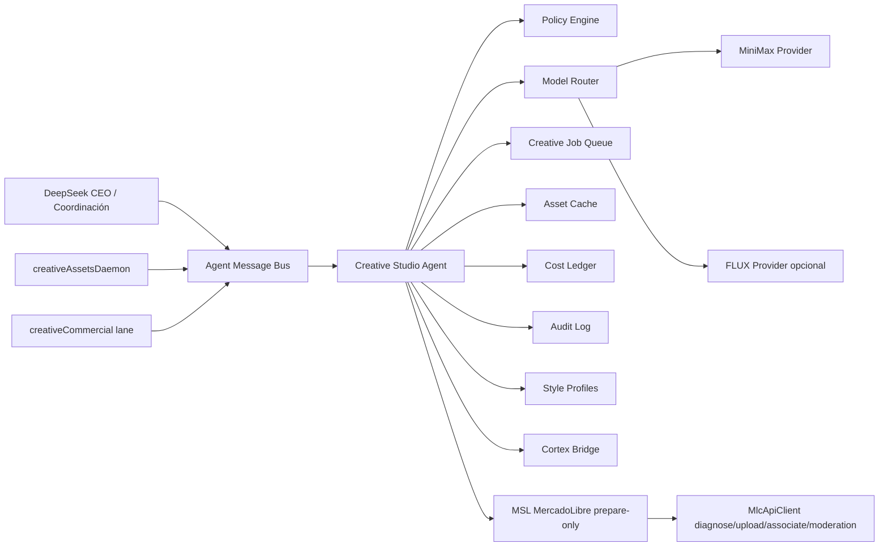
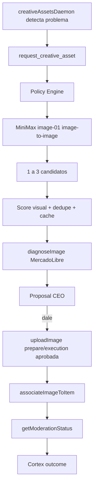
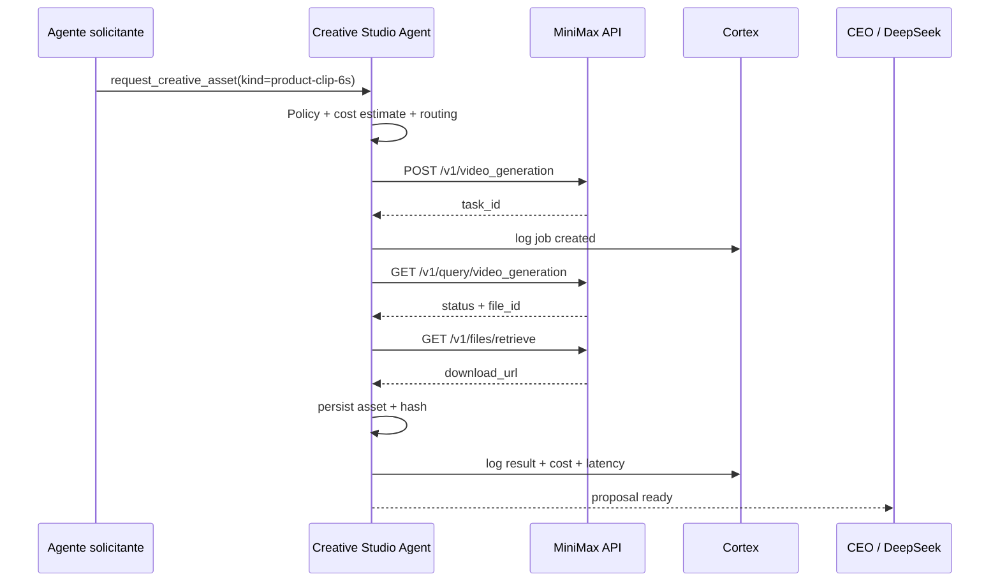

# Integración de MSL con un Creative Studio Agent basado en MiniMax

## Resumen ejecutivo

MSL ya tiene la base correcta para absorber un **Creative Studio Agent** sin romper el producto actual: CEO agent con DeepSeek, Cortex como memoria, lanes especialistas, daemons, message bus, aprobaciones explícitas tipo `dale`, flujo de imágenes MercadoLibre en modo `prepare-only` y un `creativeAssetsDaemon` que detecta problemas creativos sin remediar ni publicar automáticamente.

La recomendación principal es **mantener DeepSeek como cerebro de razonamiento, coordinación, estrategia comercial y código**, y sumar **MiniMax como brazo creativo multimodal** detrás de un agente/servicio interno centralizado. Ese agente no debe ser una tool suelta disponible para todos sin control; debe funcionar como un **departamento creativo interno** al que otros agentes le pidan activos visuales, video, voz, música o piezas de marketing cuando los necesiten.

La arquitectura objetivo es:

```text
DeepSeek = CEO / razonamiento / coordinación / estrategia / coding
Cortex = memoria, aprendizaje, outcome feedback y routing histórico
Creative Studio Agent = producción creativa multimodal centralizada
MiniMax = proveedor principal de imagen, video, voz y música
MercadoLibre API = validación, diagnóstico, upload/asociación y moderación controlada
```

El objetivo no es generar por generar. El objetivo es que MSL tenga un **órgano creativo que aprende**, controla costos, evita duplicados, mantiene consistencia visual y mejora portadas, galerías, clips, ecommerce propio y redes sociales sin inventar el producto ni saltarse las aprobaciones.

---

## Estado actual de MSL

El repo `riquelmechile/Msl` ya contiene varios componentes que hacen viable esta integración:

| Componente | Estado actual | Cómo se conecta con Creative Studio |
|---|---|---|
| CEO agent con DeepSeek | Cerebro conversacional y coordinador de especialistas | Decide cuándo pedir trabajo creativo y cómo presentarlo al CEO |
| Cortex | Memoria neuronal/durable y aprendizaje | Guarda resultados, rechazos, costos, moderación y métricas por asset |
| Agent Message Bus | Comunicación interna entre agentes | Canal para solicitudes y respuestas del Studio Agent |
| Specialist daemons | Daemons por lane que detectan oportunidades/problemas | Pueden pedir activos al Studio Agent cuando detecten necesidad |
| `creativeAssetsDaemon` | Detecta bajo número de imágenes, moderación, mal score PICTURES y alto tráfico con mala creatividad | Primer cliente natural del Studio Agent |
| MercadoLibre image orchestration | Flujo `diagnose -> upload -> associate -> moderation`, definido como prepare-only | Recibe assets aprobados desde Studio, no genera ni decide solo |
| Owned ecommerce / Medusa preview | Storefront preview con media/content readiness | Puede usar assets generados para ecommerce propio |
| Supplier/XKP enrichment | Material de proveedor y evidencia de producto | Fuente de referencia para image-to-image y clips fieles al producto |

La brecha real es clara: **MSL detecta problemas visuales, pero todavía no tiene un ejecutor creativo multimodal que prepare soluciones visuales**.

---

## Qué debe ser el Creative Studio Agent

El **Creative Studio Agent** debe ser un servicio interno, no una herramienta directa de MiniMax expuesta a todos los agentes.

### Responsabilidades

- Recibir solicitudes creativas desde otros agentes.
- Generar o editar imágenes de producto.
- Generar clips cortos de producto.
- Preparar piezas para ecommerce propio.
- Preparar packs para redes sociales.
- Usar MiniMax, y opcionalmente FLUX u otros proveedores, según costo/calidad.
- Aplicar políticas de seguridad visual.
- Registrar costo, proveedor, modelo, prompt hash, referencias, outputs y resultado.
- Aprender con Cortex qué estilos/proveedores/prompts funcionan mejor.
- Devolver candidatos o propuestas, nunca publicar directamente.

### Lo que no debe hacer

- No reemplazar DeepSeek.
- No publicar directo en MercadoLibre.
- No modificar el producto real.
- No inventar accesorios, colores, materiales o funciones.
- No generar assets sin trazabilidad.
- No saltarse el flujo `prepare-only`.
- No dar a cada agente acceso directo e independiente a MiniMax.

---

## MiniMax como proveedor creativo

MiniMax sirve para este rol porque ofrece una superficie multimodal amplia:

- Imagen: text-to-image e image-to-image.
- Video: text-to-video, image-to-video, first/last frame y subject-reference video.
- Voz/audio: text-to-speech, voice clone y voice design.
- Música: generación musical.
- Vision/search: útil vía CLI y herramientas para análisis o prototipado.

### Repos oficiales relevantes

- `MiniMax-AI/MiniMax-MCP`: servidor MCP oficial para text-to-speech, imagen, video, voz y música. Útil para prototipos, IDEs y agentes externos.
- `MiniMax-AI/cli`: CLI oficial para agentes y terminal. Permite `mmx image`, `mmx video`, `mmx speech`, `mmx music`, `mmx vision`, `mmx search` y `mmx quota`.
- `MiniMax-MCP-JS`: implementación JavaScript/TypeScript de MCP, útil como referencia si se quiere una integración MCP en TS.

### API directa vs CLI vs MCP

| Opción | Uso recomendado | Motivo |
|---|---|---|
| API directa MiniMax | Producción MSL | Mejor control de costos, reintentos, mocks, logging, task IDs, cache y auditoría |
| MiniMax CLI | Desarrollo/prototipo | Muy rápido para validar prompts, generar ejemplos y probar cuotas |
| MiniMax MCP | Integración con IDEs/agentes externos | Bueno para pruebas con clientes MCP, pero no como núcleo de runtime MSL |

Conclusión: **para producción usar API directa encapsulada en `packages/creative-studio`**. CLI/MCP quedan como herramientas de exploración y desarrollo.

---

## Arquitectura propuesta



### Paquete sugerido

```text
packages/
  creative-studio/
    src/
      index.ts
      domain/
        creative-job.ts
        creative-asset.ts
        style-profile.ts
        policy.ts
        audit-event.ts
      application/
        creative-studio-agent.ts
        creative-job-router.ts
        cost-ledger.ts
        cache-service.ts
        cortex-bridge.ts
        policy-engine.ts
      infrastructure/
        providers/
          minimax/
            minimax-client.ts
            minimax-image-provider.ts
            minimax-video-provider.ts
          flux/
            flux-image-provider.ts
        queue/
          creative-job-queue.ts
        storage/
          creative-asset-store.ts
          creative-audit-store.ts
      tools/
        request-creative-asset.tool.ts
        approve-creative-asset.tool.ts
        query-creative-task.tool.ts
      contracts/
        creative-requests.ts
        creative-events.ts
        creative-results.ts
```

---

## Contratos TypeScript base

```ts
export type CreativeChannel =
  | "mercadolibre"
  | "storefront"
  | "instagram"
  | "facebook"
  | "tiktok";

export type CreativeJobKind =
  | "product-cover-i2i"
  | "product-gallery-i2i"
  | "product-clip-6s"
  | "social-pack"
  | "brand-banner"
  | "voiceover"
  | "music-bed";

export type CreativeJobStatus =
  | "queued"
  | "policy-review"
  | "provider-routing"
  | "running"
  | "needs-human-review"
  | "approved"
  | "rejected"
  | "prepared-for-publish"
  | "published"
  | "failed";

export interface CreativeAssetRequest {
  requestId: string;
  requestedByAgent: string;
  sellerId: string;
  channel: CreativeChannel;
  kind: CreativeJobKind;
  objective: "ctr" | "conversion" | "awareness" | "moderation-fix";
  budgetTier: "low" | "standard" | "premium";
  references: Array<{
    type: "product-image" | "supplier-image" | "brand-guide" | "existing-asset";
    uri: string;
    sha256?: string;
  }>;
  productContext?: {
    itemId?: string;
    sku?: string;
    xkpId?: string;
    title?: string;
    categoryId?: string;
    requiredAttributes?: Record<string, string>;
  };
  constraints: {
    preserveProductTruth: boolean;
    noBrandInfringement: boolean;
    requiresHumanApproval: boolean;
  };
}

export interface CreativeExecutionResult {
  jobId: string;
  status: CreativeJobStatus;
  provider: "minimax" | "flux" | "local";
  model: string;
  estimatedCostUsd: number;
  actualCostUsd?: number;
  outputs: Array<{
    assetId: string;
    kind: "image" | "video" | "audio" | "music";
    storageUri: string;
    previewUrl?: string;
    sha256: string;
    policyFlags: string[];
  }>;
  noMutationExecuted: true;
}

export interface CreativeProvider {
  supports(kind: CreativeJobKind): boolean;
  estimate(request: CreativeAssetRequest): Promise<{ usd: number; notes: string[] }>;
  execute(request: CreativeAssetRequest): Promise<CreativeExecutionResult>;
}
```

---

## Tools internas mínimas

### `request_creative_asset`

Crea un job creativo y devuelve `jobId`, proveedor recomendado, costo estimado y siguiente acción.

Uso típico:

```json
{
  "requestedByAgent": "creativeAssetsDaemon",
  "sellerId": "maustian",
  "channel": "mercadolibre",
  "kind": "product-cover-i2i",
  "objective": "ctr",
  "budgetTier": "low",
  "references": [
    {
      "type": "supplier-image",
      "uri": "s3://raw-supplier/xkp/sku-443/front.jpg",
      "sha256": "..."
    }
  ],
  "productContext": {
    "itemId": "MLC123456789",
    "sku": "XKP-443",
    "categoryId": "MLC1055"
  },
  "constraints": {
    "preserveProductTruth": true,
    "noBrandInfringement": true,
    "requiresHumanApproval": true
  }
}
```

### `query_creative_task`

Consulta el estado de un job, outputs, errores, costo y próximos pasos.

### `approve_creative_asset`

Marca un asset como aprobado por CEO y permite pasar al flujo `prepare-only` correspondiente. No debe publicar directamente.

---

## Eventos de bus sugeridos

```text
creative.asset.requested
creative.asset.policy_blocked
creative.asset.queued
creative.asset.running
creative.asset.provider_task_created
creative.asset.prepared
creative.asset.failed
creative.asset.approved
creative.asset.rejected
creative.asset.sent_to_marketplace_prepare
creative.asset.published
creative.asset.outcome_recorded
```

### Ejemplo de evento preparado

```json
{
  "type": "creative.asset.prepared",
  "jobId": "cj_01JZ...",
  "status": "needs-human-review",
  "provider": "minimax",
  "model": "image-01",
  "estimatedCostUsd": 0.0105,
  "outputs": [
    {
      "assetId": "asset_01",
      "kind": "image",
      "storageUri": "s3://creative-studio/assets/asset_01.webp",
      "previewUrl": "https://internal-preview/asset_01",
      "hash": "f03a...",
      "policyFlags": []
    }
  ],
  "nextAction": "approve_creative_asset",
  "noMutationExecuted": true
}
```

---

## Flujo 1: portada image-to-image para MercadoLibre



Regla clave: **la generación ocurre antes del flujo MercadoLibre**, pero la publicación sigue bajo el sistema de aprobación y validación existente.

---

## Flujo 2: clip de producto 6s



Para MercadoLibre, el clip debe tratarse primero como **asset candidato** o para ecommerce/redes. No debe asumirse publicación automática hasta que el stack tenga soporte explícito de video, validación de formato y aprobación.

---

## Flujo 3: pack social/ecommerce

Este flujo queda para una segunda etapa.

```text
Brief comercial / producto / campaña
-> request_creative_asset(kind=social-pack)
-> MiniMax genera imágenes, clip corto, voz o música si corresponde
-> Studio guarda assets y metadata
-> CEO revisa pack
-> otro agente agenda/exporta/publica con aprobación futura
```

Usos:

- Instagram.
- TikTok.
- Facebook.
- Ecommerce propio.
- Landing/Medusa storefront.
- Campañas estacionales.

---

## Routing de modelos

| Caso | Proveedor recomendado | Motivo |
|---|---|---|
| Portada producto basada en foto real | MiniMax `image-01` | Muy barato, soporta image-to-image, ideal para candidatos rápidos |
| Lote masivo de candidatos | MiniMax `image-01` | Costo unitario bajo |
| Clip 6s | MiniMax Hailuo Fast | API de video asíncrona y bajo costo relativo |
| Hero premium ecommerce | FLUX pro/max opcional | Mayor calidad para pocas piezas de alto impacto |
| Layout con texto delicado | FLUX flex opcional | Mejor para tipografía/control fino |
| Voiceover o audio de campaña | MiniMax speech/voice | Multimodalidad dentro del mismo proveedor |
| Música de fondo | MiniMax music | Útil para clips y redes |

La primera versión puede implementar solo MiniMax. FLUX puede quedar como interface futura.

---

## Aprendizaje con Cortex

Cada job creativo debe persistir una huella para aprendizaje:

| Campo | Uso |
|---|---|
| `jobId`, `requestId`, `requestedByAgent` | Trazabilidad |
| Canal, categoría, SKU, itemId | Segmentación de performance |
| Proveedor, modelo, endpoint y parámetros | Routing y auditoría |
| Prompt, promptHash, referencesHash | Dedupe y repetibilidad |
| Coste estimado y real | Optimización económica |
| Latencia, reintentos y errores | Salud operativa |
| Moderation result | Compatibilidad MercadoLibre |
| Aprobado/rechazado/editado | Aprendizaje humano |
| CTR, visitas, conversión, engagement | Impacto comercial |

Esto permite routing adaptativo:

```text
Si MiniMax funciona bien en categoría X -> seguir MiniMax.
Si MiniMax cambia demasiado el producto -> subir a proveedor premium o pedir edición manual.
Si un estilo aumenta CTR -> reforzar estilo.
Si un tipo de prompt genera moderaciones -> penalizarlo.
```

---

## Guardrails duros

```text
1. No inventar producto.
2. No inventar accesorios.
3. No alterar color, tamaño, material o función sin evidencia.
4. No usar marcas, personajes o estilos protegidos.
5. No usar claims falsos.
6. No publicar directo a MercadoLibre.
7. No usar URLs efímeras como almacenamiento final.
8. No generar más variantes si el costo marginal no se justifica.
9. No permitir prompts sin referencia cuando el canal sea producto real.
10. Todo output debe tener prompt hash, reference hash, provider, modelo y costo.
```

---

## Costos y control económico

MiniMax es especialmente atractivo para el MVP porque el costo unitario de imagen es muy bajo.

Estrategia recomendada:

- Imagen de producto: generar 1 a 3 candidatos por producto.
- Clips: partir con 6s 768P Fast.
- Redes: packs limitados y aprobados.
- Producción: usar API directa con PayGo/créditos para control exacto.
- Desarrollo: CLI o MCP con Token Plan para pruebas.

El Studio Agent debe tener presupuesto por:

- Día.
- Seller.
- Canal.
- Agente solicitante.
- Tipo de activo.
- Prioridad comercial.

Ejemplo:

```ts
export interface CreativeBudgetPolicy {
  maxDailyUsd: number;
  maxJobUsd: number;
  maxVariantsPerRequest: number;
  requireApprovalAboveUsd: number;
  allowedProviders: Array<"minimax" | "flux" | "local">;
}
```

---

## Integración con `creativeAssetsDaemon`

Hoy el daemon detecta problemas creativos. La mejora correcta es que no solo emita alerta, sino que pueda pedir preparación de solución.

### Antes

```text
Detecta: MLC123 tiene alto tráfico y mala imagen.
Encola propuesta: revisar creatividad.
```

### Después

```text
Detecta: MLC123 tiene alto tráfico y mala imagen.
Pide a Creative Studio: genera 3 portadas candidatas usando foto real.
Studio devuelve candidatos + costo + riesgos.
Daemon/CEO presenta propuesta visual.
Si CEO dice dale, pasa a diagnose/upload/associate.
```

Función sugerida:

```ts
async function requestCreativeRemediation(input: {
  sellerId: string;
  itemId: string;
  reason: "low-image-count" | "poor-pictures-score" | "high-traffic-poor-creative" | "moderation-fix";
  evidenceIds: string[];
}): Promise<CreativeAssetRequest>;
```

---

## Integración con MercadoLibre

El Studio Agent nunca debe publicar en ML. Debe entregar candidatos al flujo existente.

```text
Creative Studio output
-> diagnoseImage
-> proposal CEO
-> uploadImage
-> associateImageToItem
-> getModerationStatus
-> Cortex outcome
```

Si `diagnoseImage` detecta watermark, texto no permitido, mala resolución o fondo problemático, ese resultado se penaliza y se pide nueva variante o revisión manual.

---

## Integración con ecommerce propio

El paquete `@msl/ecommerce-medusa` ya contempla preview y media en storefront projections. Creative Studio puede generar:

- Hero images.
- Banners.
- Galerías premium.
- Clips de producto.
- Assets para colección.

Pero debe respetar readiness checks y no publicar storefront público sin aprobación.

---

## Integración futura con redes sociales

Fase posterior:

```text
social-channel-agent
-> pide pack creativo a Creative Studio
-> recibe imágenes/video/audio/copy opcional
-> crea propuesta de campaña
-> CEO aprueba
-> scheduler publica o exporta
```

Al inicio conviene que Studio solo genere el asset, no que maneje publicación. La publicación social debe ser otro boundary con sus propias credenciales, auditoría y aprobaciones.

---

## Plan por fases

### Fase 0 — OpenSpec y contratos

- Crear `openspec/changes/add-creative-studio-agent/`.
- Definir contratos, estados, guardrails y eventos.
- Agregar variables de entorno a `.env.example` sin secretos.

### Fase 1 — paquete `@msl/creative-studio`

- Crear tipos base.
- Crear policy engine.
- Crear job queue local/mock.
- Crear provider MiniMax mock.
- Agregar tests unitarios sin llamadas externas.

### Fase 2 — MiniMax API real env-gated

- `MINIMAX_API_KEY`.
- `MINIMAX_API_HOST`.
- `MSL_CREATIVE_STUDIO_ENABLED`.
- `MSL_CREATIVE_STUDIO_WRITE_ENABLED=false` por defecto.
- Registrar costo y task IDs.
- Persistir assets en storage local primero.

### Fase 3 — integración con `creativeAssetsDaemon`

- Detectar oportunidad.
- Crear `request_creative_asset`.
- Encolar propuesta con candidatos.
- Mantener `noMutationExecuted: true`.

### Fase 4 — MercadoLibre image prepare-only

- Tomar asset aprobado.
- Ejecutar diagnóstico.
- Preparar upload/asociación.
- Registrar moderation outcome.

### Fase 5 — video clips

- Implementar video async.
- Query task.
- Download/persist.
- Propuesta CEO.

### Fase 6 — ecommerce y redes

- Usar assets en storefront preview.
- Generar packs sociales.
- Dejar publicación social como boundary futuro.

---

## Variables de entorno sugeridas

```env
# MiniMax / Creative Studio
MSL_CREATIVE_STUDIO_ENABLED=false
MSL_CREATIVE_STUDIO_PROVIDER=minimax
MINIMAX_API_KEY=
MINIMAX_API_HOST=https://api.minimax.io
MSL_CREATIVE_STUDIO_STORAGE_PATH=.msl/creative-assets
MSL_CREATIVE_STUDIO_DB_PATH=.msl/creative-studio.sqlite
MSL_CREATIVE_STUDIO_MAX_DAILY_USD=5
MSL_CREATIVE_STUDIO_MAX_JOB_USD=0.50
MSL_CREATIVE_STUDIO_WRITE_ENABLED=false
```

Regla: `WRITE_ENABLED` no debe significar publicar en MercadoLibre; solo habilita ejecución real de proveedor. La publicación externa sigue en sus propios gates.

---

## OpenSpec sugerido

```text
openspec/changes/add-creative-studio-agent/
  proposal.md
  design.md
  tasks.md
  specs/
    creative-studio-agent/
      spec.md
    specialist-daemons/
      spec.md
    mercadolibre-image-orchestration/
      spec.md
```

### Requirements iniciales

```markdown
### Requirement: Centralized creative asset requests
Any internal agent that needs generated or edited media SHALL request it through the Creative Studio Agent rather than calling external media providers directly.

### Requirement: No external mutation
The Creative Studio Agent SHALL NOT publish, upload, associate, schedule, or mutate external business channels directly.

### Requirement: Product truth preservation
For product media jobs, the Creative Studio Agent SHALL preserve the real product identity, color, material, size, included accessories, and function unless evidence explicitly supports a change.

### Requirement: Cost and provenance ledger
Every generated asset SHALL store provider, model, prompt hash, reference hash, cost estimate, actual cost when available, latency, requester agent, channel, and outcome.

### Requirement: Cortex feedback
The Creative Studio Agent SHALL record CEO approval, rejection, moderation result, and downstream commercial metrics as learning evidence for future routing.
```

---

## Commits sugeridos

```text
docs: add MiniMax creative studio integration plan
feat(creative-studio): add internal creative studio contracts and policy engine
feat(creative-studio): add MiniMax image provider behind env gate
feat(creative-assets-daemon): delegate visual remediation to creative studio
feat(creative-studio): persist creative outcomes and cost ledger
feat(creative-studio): add async MiniMax video jobs
```

---

## Decisión final

La forma más cohesionada con MSL es:

```text
Mantener DeepSeek como cerebro.
Crear Creative Studio Agent como servicio interno.
Usar MiniMax como proveedor creativo principal.
Conectar todo por message bus, Cortex, cost ledger y approval gates.
Dejar MercadoLibre/ecommerce/redes como canales de salida controlados, no como responsabilidades directas del Studio.
```

Esto permite que cualquier agente de la empresa pida activos visuales sin duplicar lógica ni perder control. El Studio aprende con el tiempo, optimiza costo/calidad, conserva consistencia de marca y mantiene el producto real protegido.
