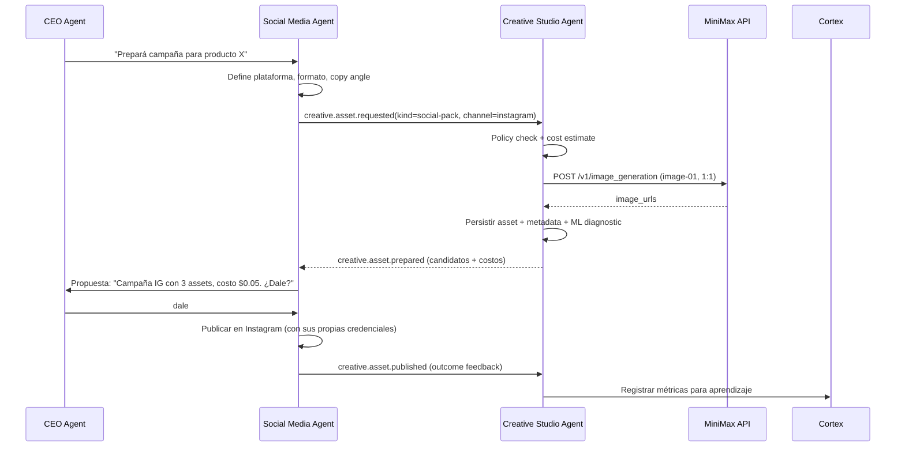

# Creative Studio Agent — Integración MiniMax en MSL

> **Versión 2.0 — Verificada contra documentación oficial (Julio 2026)**
>
> Fuentes: [MiniMax API Reference](https://platform.minimax.io/docs/api-reference), [MercadoLibre Images](https://developers.mercadolibre.com.ar/es_ar/trabajar-con-imagenes), [ML Image Diagnosis](https://developers.mercadolibre.com.ar/es_ar/diagnostico-imagenes), [ML Image Moderation](https://developers.mercadolibre.com.ar/es_ar/moderaciones-de-imagenes)

---

## Resumen ejecutivo

MSL ya tiene la base para un **Creative Studio Agent**: CEO con DeepSeek, Cortex como memoria, lanes especialistas, daemons autónomos, agent message bus, aprobaciones explícitas y `creativeAssetsDaemon` + `creativeCommercialDaemon` detectando problemas y oportunidades. Pero **detecta sin ejecutar**. La brecha es clara: falta el ejecutor creativo multimodal.

**Propuesta**: Crear `creative-studio` como un **agent lane + daemon real** dentro del ecosistema MSL — no como una tool suelta ni como un servicio externo. Debe ser un agente más de la empresa interna, registrado en `companyAgents`, con su propio lane contract, que recibe mensajes por el bus y responde con propuestas creativas trazables. MiniMax es el proveedor principal de imagen y video. La generación es siempre prepare-only: el Studio propone, el CEO (o futuro agente de redes) aprueba, y solo entonces se ejecuta.

### Arquitectura objetivo

```text
DeepSeek              = CEO / razonamiento / coordinación / estrategia
Cortex                = memoria neuronal, aprendizaje, outcome feedback
Agent Message Bus     = sistema nervioso interno (ya implementado)
Creative Studio Agent = agente lane + daemon de producción creativa
MiniMax API           = proveedor de imagen, video, voz y música
MercadoLibre API      = diagnóstico, upload/asociación, moderación (prepare-only)
Social Media Agent    = [futuro] boundary de publicación en redes
```

### Lo que NO es

- No es una tool de MiniMax accesible para cualquier agente sin control.
- No es un servicio externo que reemplaza a DeepSeek.
- No publica directamente en MercadoLibre ni redes sociales.
- No modifica el producto real ni inventa atributos.

### Lo que SÍ es

- Es un **agent lane** con daemon propio que recibe trabajos por el message bus.
- Centraliza TODA la generación creativa multimodal de la empresa MSL.
- Es el único punto de contacto con la API de MiniMax.
- Aprende con Cortex qué funciona y qué no (costos, estilos, canales, outcomes).
- Propone assets al CEO; nunca ejecuta publicación sin aprobación.

---

## Estado actual de MSL (verificado contra código)

| Componente                 | Estado                                          | Rol en Creative Studio                                |
| -------------------------- | ----------------------------------------------- | ----------------------------------------------------- |
| Agent Message Bus          | ✅ Implementado (`agentMessageBusStore.ts`)     | Canal para `creative.asset.requested` y respuestas    |
| Daemon Scheduler           | ✅ Implementado (4 daemons activos)             | El Studio será un 5º daemon                           |
| `creativeAssetsDaemon`     | ✅ Detecta problemas de imágenes                | Cliente natural: detecta → pide generación al Studio  |
| `creativeCommercialDaemon` | ✅ Detecta oportunidades comerciales/creativas  | Cliente natural: detecta → pide social pack al Studio |
| `creative-assets` lane     | ✅ Lane contract definido                       | Se extiende para incluir al Studio Agent              |
| `creative-commercial` lane | ✅ Lane contract definido                       | Se extiende para incluir social content               |
| Cortex                     | ✅ Memoria con spreading activation             | Outcome feedback para routing de modelos/estilos      |
| ML Image Orchestration     | ✅ `diagnose → upload → associate` prepare-only | Recibe assets aprobados del Studio                    |
| Owned Ecommerce (Medusa)   | ✅ Storefront preview                           | Consume assets del Studio para ecommerce propio       |
| Agent Consensus            | ✅ `agent_reviews` con quorum                   | Revisa propuestas creativas de alto riesgo/costo      |
| **Creative Studio Agent**  | ❌ **NO EXISTE**                                | **Esta propuesta**                                    |
| **Social Media Agent**     | ❌ **NO EXISTE**                                | **Fase futura — contrato definido acá**               |

---

## Requisitos oficiales de MercadoLibre para imágenes

> Verificados contra la [documentación oficial](https://developers.mercadolibre.com.ar/es_ar/trabajar-con-imagenes) y [API de diagnóstico](https://developers.mercadolibre.com.ar/es_ar/diagnostico-imagenes).

### Especificaciones de imagen

| Parámetro              | Valor                         | Nota                                     |
| ---------------------- | ----------------------------- | ---------------------------------------- |
| Formatos aceptados     | **JPG, JPEG, PNG**            | Solo estos tres                          |
| Espacio de color       | **RGB** (no CMYK)             | La imagen debe ocupar el 95% del espacio |
| Tamaño máximo          | **10 MB**                     |                                          |
| Tamaño recomendado     | **1200 × 1200 px**            |                                          |
| Tamaño máximo aceptado | **1920 × 1920 px**            | Se redimensiona a esta versión (F)       |
| Tamaño mínimo          | **500 × 500 px**              | No se agranda si es menor                |
| Zoom widget            | Se activa si ancho > 800 px   |                                          |
| Upload endpoint        | `POST /pictures/items/upload` | Multipart form-data                      |
| Associate endpoint     | `POST /items/{id}/pictures`   | Con `picture_id`                         |

### API de diagnóstico

Endpoint: `POST /moderations/pictures/diagnostic`

**Criterios que evalúa** (según categoría):

| Criterio      | Campo `name`       | Qué detecta                             |
| ------------- | ------------------ | --------------------------------------- |
| Fondo blanco  | `white_background` | Fondo no blanco digitalizado            |
| Tamaño mínimo | `minimum_size`     | Imagen por debajo del mínimo            |
| Texto/logo    | `text_logo`        | Logos o texto no permitido en la imagen |
| Marca de agua | `watermark`        | Watermarks en la imagen                 |

**Tipos de imagen** (`picture_type`):

| Tipo                  | Rol                  | Reglas                          |
| --------------------- | -------------------- | ------------------------------- |
| `thumbnail`           | Imagen principal     | Las más estrictas               |
| `variation_thumbnail` | Imagen de variante   | Estrictas, varían por categoría |
| `other`               | Imágenes secundarias | Más flexibles                   |

**Body del request:**

```json
{
  "picture_url": "URL pública o base64",
  "picture_id": "ID de imagen existente en CDN de ML (alternativo)",
  "context": {
    "category_id": "MLC1055",
    "title": "Título de la publicación",
    "picture_type": "thumbnail"
  }
}
```

**IMPORTANTE**: Solo uno de `picture_url` o `picture_id`. Siempre especificar `picture_type` para diagnósticos precisos.

### Moderaciones de imágenes

Posibles moderaciones con tag `poor_quality_thumbnail`:

- **WATERMARK**: marcas de agua
- **MULTIPLE**: múltiples problemas (mala iluminación, producto cortado, watermark, logo/texto)
- Status puede ser `active` o `paused`

---

## MercadoLibre Clips (Videos) — Estado actual

### El producto existe, la API no (todavía)

> **Verificado Julio 2026**: MercadoLibre tiene **"Clips"** (también llamado "Videos"), una plataforma de videos cortos estilo TikTok/Reels integrada en el marketplace.

**Lo que SÍ existe (producto)**:

| Feature               | Detalle                                                                                       |
| --------------------- | --------------------------------------------------------------------------------------------- |
| Nombre oficial        | "Clips" / "Videos"                                                                            |
| URL                   | `mercadolibre.cl/shorts/clips`, `mercadolibre.cl/video/creator`                               |
| Impacto reportado     | **4× más visitas**, **2× más ventas** en promedio                                             |
| Costo                 | **100% gratis**, ilimitado                                                                    |
| Dónde se muestra      | Home, publicaciones, Mercado Play, sección "Videos"                                           |
| Creación              | Desde app mobile (grabar o subir) o dashboard web                                             |
| AI integrada          | ML ofrece **guiones generados por IA** basados en el producto, preguntas frecuentes y reviews |
| Música                | **Librería de música libre de derechos** incluida                                             |
| Agencias certificadas | Partners oficiales que crean clips por vos                                                    |

**Requisitos de formato**:

| Parámetro       | Valor                                                    |
| --------------- | -------------------------------------------------------- |
| Orientación     | **Vertical** (9:16)                                      |
| Duración máxima | **1 minuto**                                             |
| Contenido       | Un solo producto por video                               |
| Audio           | Bueno, sin ruido de fondo                                |
| Estilo          | Mostrar producto en acción/contexto, divertido y genuino |
| Subtítulos      | Recomendados                                             |
| Moderación      | Revisión manual (hasta 2 días hábiles)                   |

**Herramientas que ML da gratis al seller**:

- Música libre de derechos (auto-añadida si no elegís)
- Guiones generados por IA (basados en producto + FAQ + reviews)
- Contenido mensual sugerido por tipo de video que convierte
- Canal de apelación de moderación

**Lo que NO existe (API)**:

| Lo que falta                   | Detalle                                                       |
| ------------------------------ | ------------------------------------------------------------- |
| API de upload de video         | ❌ No hay endpoint documentado en developers.mercadolibre.com |
| API de moderación de video     | ❌ Solo disponible vía dashboard/ayuda                        |
| API de analytics de Clips      | ❌ No expuesto programáticamente                              |
| `video_id` en recurso `/items` | ❌ El recurso item no tiene campo de video                    |

### Estrategia recomendada para video en ML

```text
Fase actual (sin API):
  1. Creative Studio Agent genera el clip (MiniMax Hailuo T2V/I2V)
  2. El clip se guarda como asset candidato en storage local
  3. El CEO recibe la propuesta: "Clip listo para MLC123. Formato vertical 9:16, 30s."
  4. El CEO (humano) sube manualmente el clip a ML desde el dashboard/app
  5. Cortex registra el outcome cuando ML aprueba/rechaza

Fase futura (cuando ML exponga API de Clips):
  1-3. Ídem
  4. El agente propone upload programático vía API (prepare-only)
  5. CEO aprueba → upload automático → moderación → outcome en Cortex
```

**Regla**: El Studio Agent genera el clip en formato vertical 9:16 listo para ML Clips, pero **no puede hacer el upload programático** hasta que exista la API. Mientras tanto, la acción es "propuesta al CEO con asset descargable".

### Estrategia de video por canal

| Canal                         | API disponible        | Acción del Studio                               |
| ----------------------------- | --------------------- | ----------------------------------------------- |
| **ML Clips**                  | ❌ Sin API            | Generar clip → CEO sube manualmente             |
| **Ecommerce propio (Medusa)** | ✅ Storefront preview | Generar clip → asociar a storefront projection  |
| **Redes sociales (futuro)**   | ⚠️ APIs externas      | Generar clip → Social Agent publica             |
| **ML Product Ads (video)**    | ⚠️ Posible            | Verificar endpoint de creative asset en Ads API |

---

## MiniMax como proveedor — API verificada

> Fuente: [MiniMax API Reference](https://platform.minimax.io/docs/api-reference)

### Image Generation

**Endpoint**: `POST https://api.minimax.io/v1/image_generation`

| Parámetro           | Tipo   | Requerido | Detalle                                                                           |
| ------------------- | ------ | --------- | --------------------------------------------------------------------------------- |
| `model`             | string | ✅        | `image-01` o `image-01-live`                                                      |
| `prompt`            | string | ✅        | Máx 1500 caracteres                                                               |
| `subject_reference` | array  | ❌        | Para image-to-image. Objetos `{type: "character", image_file: "url"}`             |
| `aspect_ratio`      | string | ❌        | `1:1` (1024×1024), `16:9` (1280×720), `4:3`, `3:2`, `2:3`, `3:4`, `9:16`, `21:9`  |
| `width` / `height`  | int    | ❌        | 512–2048 px, múltiplos de 8. Si se especifica con aspect_ratio, aspect_ratio gana |
| `n`                 | int    | ❌        | 1–9 imágenes por request (default 1)                                              |
| `response_format`   | string | ❌        | `url` (expira en 24h) o `base64`                                                  |
| `prompt_optimizer`  | bool   | ❌        | Auto-optimizar prompt (default false)                                             |

**Especificaciones para MercadoLibre**: Generar a 1200×1200 (`aspect_ratio: "1:1"` con `width: 1200, height: 1200`). Idealmente `response_format: "url"` para download y posterior upload a ML.

**Costos**: ~$0.01–$0.02 USD por imagen (modelo `image-01`). Verificar pricing actualizado en [MiniMax Pricing](https://platform.minimax.io/docs/pricing).

### Video Generation

**Endpoint**: `POST https://api.minimax.io/v1/video_generation`  
**Query**: `GET https://api.minimax.io/v1/query/video_generation?task_id={task_id}`  
**Download**: `GET https://api.minimax.io/v1/files/retrieve?file_id={file_id}`

#### Modos de generación

| Modo                          | Parámetros clave                                    | Modelos                                                                                                          |
| ----------------------------- | --------------------------------------------------- | ---------------------------------------------------------------------------------------------------------------- |
| **Text-to-Video** (T2V)       | `prompt` requerido                                  | `MiniMax-Hailuo-2.3`, `MiniMax-Hailuo-02`, `T2V-01-Director`, `T2V-01`                                           |
| **Image-to-Video** (I2V)      | `first_frame_image` requerido + `prompt` opcional   | `MiniMax-Hailuo-2.3`, `MiniMax-Hailuo-2.3-Fast`, `MiniMax-Hailuo-02`, `I2V-01-Director`, `I2V-01-live`, `I2V-01` |
| **First & Last Frame** (FL2V) | `first_frame_image` + `last_frame_image` + `prompt` | Solo `MiniMax-Hailuo-02`                                                                                         |
| **Subject Reference** (S2V)   | `subject_reference` + `prompt`                      | `S2V-01`                                                                                                         |

#### Parámetros comunes de video

| Parámetro           | Tipo   | Detalle                                                                                                                                                                                                           |
| ------------------- | ------ | ----------------------------------------------------------------------------------------------------------------------------------------------------------------------------------------------------------------- |
| `prompt`            | string | Máx 2000 chars. Soporta 15 comandos de cámara: `[Truck left]`, `[Pan right]`, `[Push in]`, `[Pull out]`, `[Pedestal up]`, `[Tilt down]`, `[Zoom in]`, `[Zoom out]`, `[Shake]`, `[Tracking shot]`, `[Static shot]` |
| `duration`          | int    | `6` o `10` segundos (depende del modelo y resolución)                                                                                                                                                             |
| `resolution`        | string | `512P`, `720P`, `768P`, `1080P`                                                                                                                                                                                   |
| `first_frame_image` | string | URL pública o base64. Formatos: JPG, JPEG, PNG, WebP. <20MB. Short edge >300px.                                                                                                                                   |
| `prompt_optimizer`  | bool   | Default `true`. Auto-optimiza el prompt.                                                                                                                                                                          |
| `fast_pretreatment` | bool   | Reduce tiempo de optimización (solo Hailuo-2.3 y Hailuo-02)                                                                                                                                                       |

#### Flujo asíncrono

```text
1. POST /v1/video_generation → {task_id: "12345", base_resp: {status_code: 0}}
2. Poll GET /v1/query/video_generation?task_id=12345 → {status: "processing"} o {status: "success", file_id: "abc"}
3. GET /v1/files/retrieve?file_id=abc → {file: {download_url: "https://..."}}
4. Download y persistir en storage local
```

**Modelos recomendados por caso de uso**:

| Caso                       | Modelo                    | Resolución | Duración |
| -------------------------- | ------------------------- | ---------- | -------- |
| Product clip rápido (I2V)  | `MiniMax-Hailuo-2.3-Fast` | 768P       | 6s       |
| Product clip calidad (I2V) | `MiniMax-Hailuo-2.3`      | 1080P      | 6s       |
| Demo desde cero (T2V)      | `T2V-01-Director`         | 720P       | 6s       |
| Transición A→B (FL2V)      | `MiniMax-Hailuo-02`       | 768P       | 6s       |

### Voz y música (capacidad futura)

- **Text-to-Speech**: `POST /v1/t2a_v2` — voces predefinidas y voice cloning
- **Music**: `POST /v1/music_generation` — generación de música instrumental
- **Voice Design**: crear voces personalizadas con `POST /v1/voice_design`

Para el MVP, voz y música no son prioritarios. Se agregan como providers cuando el Social Media Agent los necesite.

---

## Diseño del agente: Creative Studio como lane + daemon

El Creative Studio Agent debe ser un **ciudadano de primera clase** en la empresa MSL, no un servicio externo.

### Registro como lane

```ts
// en lanes.ts
export const CREATIVE_STUDIO_LANE: LaneContract = {
  laneId: "creative-studio",
  label: "Creative Studio",
  stablePrefix: [
    "You are the Creative Studio lane.",
    "Generate or edit product images, short clips, and creative assets on demand.",
    "Receive creative requests via the agent message bus from any authorized agent.",
    "Apply image policies, MercadoLibre diagnostic pre-checks, and cost controls.",
    "Return candidate assets with cost, provider, and policy metadata.",
    "Never publish directly to any channel. Always require CEO (or channel agent) approval.",
    phaseOneBoundary,
  ].join("\n"),
  refreshableContextProvider:
    "creative job queue, MiniMax API, Cortex outcome history, style profiles",
  inputs: ["creative-asset-request", "product-context", "reference-images", "channel-constraints"],
  outputs: [
    "creative-execution-result",
    "candidate-assets",
    "policy-flags",
    "cost-report",
    "evidence-ids",
  ],
  boundaries: [
    "prepare-only; never publish, upload, or mutate external channels",
    "never generate without product truth constraints",
    "never exceed budget without approval",
    phaseOneBoundary,
  ],
  requiredEvidenceKinds: ["product", "reference-image", "channel-constraint"],
  credentialScope: "api-key", // MINIMAX_API_KEY
};
```

### Registro como company agent

```ts
// en companyAgents.ts
creativeStudio: {
  agentId: "creative-studio",
  name: "Creative Studio Agent",
  type: "specialist",
  laneId: "creative-studio",
  capabilities: ["image-generation", "video-generation", "image-editing"],
  tools: ["request_creative_asset", "query_creative_task", "approve_creative_asset"],
  runtime: "daemon", // se ejecuta como daemon en el scheduler
}
```

### Daemon Studio

El daemon `creativeStudioDaemon`:

1. **Poll** mensajes del bus con `receiverAgentId: "creative-studio"` y status `pending`
2. **Claim** mensaje (status → `processing`)
3. **Validar** request contra policy engine (budget, seguridad, formato)
4. **Rutear** al provider correcto (MiniMax image/video según `CreativeJobKind`)
5. **Ejecutar** generación (async para video, sync para imagen)
6. **Persistir** asset + metadata + cost en storage
7. **Pre-diagnosticar** contra reglas de MercadoLibre (si el canal es `mercadolibre`)
8. **Responder** al bus con `CreativeExecutionResult`
9. **Registrar** en Cortex para aprendizaje futuro

### Contratos de mensajes en el bus

#### Request: `creative.asset.requested`

```json
{
  "requestId": "cj_01JZ...",
  "requestedByAgent": "creative-assets-daemon",
  "sellerId": "maustian",
  "channel": "mercadolibre",
  "kind": "product-cover-i2i",
  "objective": "ctr",
  "budgetTier": "low",
  "references": [
    {
      "type": "supplier-image",
      "uri": "s3://raw-supplier/xkp/sku-443/front.jpg",
      "sha256": "abc123..."
    }
  ],
  "productContext": {
    "itemId": "MLC123456789",
    "sku": "XKP-443",
    "title": "Producto Real X",
    "categoryId": "MLC1055"
  },
  "constraints": {
    "preserveProductTruth": true,
    "noBrandInfringement": true,
    "requiresHumanApproval": true
  }
}
```

#### Response: `creative.asset.prepared`

```json
{
  "type": "creative.asset.prepared",
  "jobId": "cj_01JZ...",
  "requestId": "cj_01JZ...",
  "status": "needs-human-review",
  "provider": "minimax",
  "model": "image-01",
  "estimatedCostUsd": 0.015,
  "actualCostUsd": 0.0148,
  "outputs": [
    {
      "assetId": "asset_01",
      "kind": "image",
      "storageUri": "file://.msl/creative-studio/assets/asset_01.webp",
      "previewUrl": "https://internal-preview/asset_01",
      "sha256": "f03a...",
      "mlDiagnostic": {
        "passed": true,
        "picture_type": "thumbnail",
        "detections": []
      },
      "policyFlags": []
    }
  ],
  "nextAction": "approve_creative_asset",
  "noMutationExecuted": true
}
```

### Tipos TypeScript

```ts
export type CreativeChannel = "mercadolibre" | "storefront" | "instagram" | "facebook" | "tiktok";

export type CreativeJobKind =
  | "product-cover-i2i" // Portada desde foto real (MiniMax image-01)
  | "product-gallery-i2i" // Galería secundaria desde foto real
  | "product-clip-6s" // Clip 6s I2V genérico (Hailuo-2.3-Fast)
  | "product-clip-10s" // Clip 10s I2V
  | "ml-clip-vertical-30s" // Clip vertical 9:16 para ML Clips (max 1min, típico 30s)
  | "social-pack" // Pack para redes (imagen + clip + copy)
  | "storefront-hero" // Hero image para ecommerce propio
  | "storefront-banner" // Banner para storefront
  | "voiceover" // Voz para clip/producto
  | "music-bed"; // Música de fondo

export type CreativeJobStatus =
  | "queued"
  | "policy-review"
  | "provider-routing"
  | "running" // MiniMax procesando (sync: imagen, async: video polling)
  | "needs-human-review"
  | "approved"
  | "rejected"
  | "prepared-for-publish"
  | "published"
  | "failed";

export interface CreativeAssetRequest {
  requestId: string;
  requestedByAgent: string; // agent ID del solicitante (e.g. "creative-assets-daemon")
  sellerId: string;
  channel: CreativeChannel;
  kind: CreativeJobKind;
  objective: "ctr" | "conversion" | "awareness" | "moderation-fix" | "engagement";
  budgetTier: "low" | "standard" | "premium";
  references: Array<{
    type: "product-image" | "supplier-image" | "brand-guide" | "existing-asset";
    uri: string;
    sha256?: string;
  }>;
  productContext?: {
    itemId?: string;
    sku?: string;
    title?: string;
    categoryId?: string;
  };
  constraints: {
    preserveProductTruth: boolean;
    noBrandInfringement: boolean;
    requiresHumanApproval: boolean;
    channelFormat?: {
      // Para MercadoLibre imágenes
      ml?: {
        pictureType: "thumbnail" | "variation_thumbnail" | "other";
        expectedCategoryId: string;
      };
      // Para MercadoLibre Clips (video)
      mlClips?: {
        orientation: "vertical"; // 9:16 requerido por ML
        maxDurationSeconds: 60; // Máximo 1 minuto por ML
        recommendedDurationSeconds: 30; // Recomendado para mejor engagement
      };
      // Para redes sociales
      social?: {
        platform: "instagram" | "facebook" | "tiktok";
        aspectRatio: "1:1" | "4:5" | "9:16" | "16:9";
        maxDurationSeconds?: number;
      };
    };
  };
}

export interface MlDiagnosticResult {
  passed: boolean;
  picture_type: string;
  detections: Array<{
    name: "white_background" | "minimum_size" | "text_logo" | "watermark";
    wordings: Array<{ kind: string; value: string }>;
  }>;
}

export interface CreativeExecutionResult {
  jobId: string;
  requestId: string;
  status: CreativeJobStatus;
  provider: "minimax" | "flux" | "local";
  model: string;
  estimatedCostUsd: number;
  actualCostUsd?: number;
  outputs: Array<{
    assetId: string;
    kind: "image" | "video" | "audio" | "music";
    storageUri: string;
    previewUrl?: string;
    sha256: string;
    mlDiagnostic?: MlDiagnosticResult;
    policyFlags: string[];
  }>;
  noMutationExecuted: true;
}
```

### Routing de modelos (versión verificada)

| Caso                           | Modelo MiniMax                 | Especificación       | Costo estimado | Nota                                                |
| ------------------------------ | ------------------------------ | -------------------- | -------------- | --------------------------------------------------- |
| Portada producto i2i           | `image-01`                     | 1200×1200, 1:1       | ~$0.015/img    | Subject reference desde foto de proveedor           |
| Galería secundaria             | `image-01`                     | 1200×1200, 1:1       | ~$0.015/img    | Mismo modelo, prompts por ángulo                    |
| **ML Clip vertical 30s**       | `MiniMax-Hailuo-2.3`           | 1080×1920, 9:16, 30s | ~$0.30/clip    | Formato nativo ML Clips. I2V desde foto de producto |
| ML Clip vertical 60s           | `MiniMax-Hailuo-2.3`           | 1080×1920, 9:16, 60s | ~$0.50/clip    | Máximo permitido por ML. I2V                        |
| Clip producto 6s rápido (I2V)  | `MiniMax-Hailuo-2.3-Fast`      | 768P, 6s             | ~$0.10/clip    | Para preview/storefront/social                      |
| Clip producto 6s calidad (I2V) | `MiniMax-Hailuo-2.3`           | 1080P, 6s            | ~$0.20/clip    | Mayor calidad visual                                |
| Demo desde cero (T2V)          | `T2V-01-Director`              | 720P, 6s             | ~$0.15/clip    | Sin imagen de referencia                            |
| Hero ecommerce premium         | `image-01`                     | 1920×1080, 16:9      | ~$0.02/img     | Mayor resolución                                    |
| Social pack (imagen + clip)    | `image-01` + `Hailuo-2.3-Fast` | Varía por red        | ~$0.12/pack    | Batch coordinado                                    |
| Video first+last frame         | `MiniMax-Hailuo-02`            | 768P, 6s             | ~$0.25/clip    | Transición controlada A→B                           |

---

## Contrato con el futuro Social Media Agent

El Creative Studio Agent y el Social Media Agent son dos boundaries distintos. Este contrato define cómo interactúan.

### Responsabilidades divididas

| Responsabilidad                  | Creative Studio Agent | Social Media Agent              |
| -------------------------------- | --------------------- | ------------------------------- |
| Generar imagen/video             | ✅                    | ❌                              |
| Aplicar políticas de marca       | ✅                    | ❌                              |
| Diagnosticar contra reglas ML    | ✅                    | ❌                              |
| Controlar costos de generación   | ✅                    | ❌                              |
| Elegir plataforma y horario      | ❌                    | ✅                              |
| Escribir copy social             | ❌                    | ✅                              |
| Publicar en Instagram/TikTok/etc | ❌                    | ✅                              |
| Medir engagement/CTR social      | ❌                    | ✅                              |
| Re-optimizar basado en métricas  | ❌                    | ✅ (pide nuevo asset al Studio) |

### Flujo de interacción



### Eventos del bus entre Studio y Social

```text
# Del Social Media Agent al Creative Studio
creative.asset.requested     → "Necesito un social pack para IG"
creative.asset.cancelled     → "Cancelá ese job, cambiamos de estrategia"

# Del Creative Studio al Social Media Agent
creative.asset.prepared      → "Acá tenés los candidatos, revisá y pedí aprobación"
creative.asset.failed        → "No se pudo generar, razón: X"
creative.asset.published     → "Confirmado: el asset se publicó en IG"

# Del Social Media Agent al CEO (aprobación)
social.campaign.proposed     → "Revisá esta campaña antes de publicar"
social.campaign.approved     → "CEO dijo dale"
social.campaign.published    → "Campaña publicada en IG, link: ..."
```

---

## Integración con `creativeAssetsDaemon` y `creativeCommercialDaemon`

### creativeAssetsDaemon (existente) → Creative Studio (nuevo)

```text
Actualmente:
  creativeAssetsDaemon detecta baja cantidad de imágenes, moderación,
  mal score PICTURES, alto tráfico con mala creatividad.
  → Emite alerta al CEO.

Con Creative Studio:
  creativeAssetsDaemon detecta → genera CreativeAssetRequest
  → envía al bus para creative-studio
  → Studio genera candidatos
  → Studio responde con propuesta al CEO
  → CEO revisa y aprueba/rechaza
  → Si aprueba, pasa a diagnose → upload → associate
```

### creativeCommercialDaemon (existente) → Creative Studio (nuevo)

```text
Actualmente:
  creativeCommercialDaemon detecta productos con alta visita, baja conversión,
  stock estancado, candidatos para contenido social.
  → Emite propuesta al CEO.

Con Creative Studio:
  creativeCommercialDaemon detecta → genera CreativeAssetRequest
  → envía al bus para creative-studio (kind=social-pack o product-clip-6s)
  → Studio genera assets para redes o ecommerce
  → Studio responde con propuesta
  → CEO o Social Media Agent decide publicación
```

---

## Estructura del paquete `@msl/creative-studio`

```text
packages/
  creative-studio/
    package.json
    tsconfig.json
    src/
      index.ts
      contracts/
        creative-requests.ts      # CreativeAssetRequest, CreativeExecutionResult
        creative-events.ts        # Eventos del bus
        creative-channels.ts      # CreativeChannel, MlDiagnosticResult
      domain/
        creative-job.ts           # Entidad CreativeJob
        creative-asset.ts         # Entidad CreativeAsset
        style-profile.ts          # Perfil de estilo por seller/canal
        policy.ts                 # Reglas de validación pre-generación
        budget-policy.ts          # Políticas de presupuesto
        audit-event.ts            # Evento de auditoría
      application/
        creative-studio-agent.ts  # Orquestador principal
        creative-job-router.ts    # Decide provider/modelo según kind y budget
        policy-engine.ts          # Validación pre-generación
        cost-ledger.ts            # Registro de costos por job
        cortex-bridge.ts          # Feedback loop con Cortex
        ml-diagnostic-adapter.ts  # Pre-diagnóstico contra reglas ML
      infrastructure/
        providers/
          minimax/
            minimax-client.ts           # HTTP client con auth y retry
            minimax-image-provider.ts   # POST /v1/image_generation
            minimax-video-provider.ts   # POST /v1/video_generation + polling
            minimax-audio-provider.ts   # [futuro] TTS y música
        storage/
          creative-asset-store.ts       # Persistencia local de assets
          creative-job-store.ts         # SQLite para jobs
        queue/
          creative-job-queue.ts         # Cola interna de jobs
      tools/
        request-creative-asset.tool.ts  # Tool: crear un job creativo
        approve-creative-asset.tool.ts  # Tool: aprobar asset (CEO)
        query-creative-task.tool.ts     # Tool: consultar estado de job
      daemon/
        creative-studio-daemon.ts       # Daemon que procesa el bus
      __tests__/
        creative-studio-agent.test.ts
        minimax-image-provider.test.ts
        minimax-video-provider.test.ts
        policy-engine.test.ts
        ml-diagnostic-adapter.test.ts
```

---

## Control de costos

### Variables de entorno

```env
# Creative Studio
MSL_CREATIVE_STUDIO_ENABLED=false
MSL_CREATIVE_STUDIO_PROVIDER=minimax
MINIMAX_API_KEY=
MINIMAX_API_HOST=https://api.minimax.io
MSL_CREATIVE_STUDIO_STORAGE_PATH=.msl/creative-studio/assets
MSL_CREATIVE_STUDIO_DB_PATH=.msl/creative-studio/studio.sqlite

# Budget (por día, en USD)
MSL_CREATIVE_STUDIO_MAX_DAILY_USD=5.00
MSL_CREATIVE_STUDIO_MAX_JOB_USD=0.50
MSL_CREATIVE_STUDIO_MAX_VARIANTS=9

# Write gate
MSL_CREATIVE_STUDIO_WRITE_ENABLED=false

# Rate limiting
MSL_CREATIVE_STUDIO_MAX_CONCURRENT_JOBS=3
MSL_CREATIVE_STUDIO_MIN_COOLDOWN_MS=2000
```

### BudgetPolicy

```ts
export interface CreativeBudgetPolicy {
  maxDailyUsd: number;
  maxJobUsd: number;
  maxVariantsPerRequest: number;
  requireApprovalAboveUsd: number; // pedir aprobación CEO extra si el job supera esto
  allowedProviders: Array<"minimax" | "flux" | "local">;
  dailySpentUsd: number; // se actualiza con cada job
  resetAt: string; // UTC midnight
}

export function canAfford(
  policy: CreativeBudgetPolicy,
  estimatedCostUsd: number,
): { allowed: boolean; reason?: string } {
  if (policy.dailySpentUsd + estimatedCostUsd > policy.maxDailyUsd) {
    return { allowed: false, reason: `Daily budget exceeded (${policy.maxDailyUsd} USD)` };
  }
  if (estimatedCostUsd > policy.maxJobUsd) {
    return {
      allowed: false,
      reason: `Job cost ${estimatedCostUsd} exceeds max ${policy.maxJobUsd} USD`,
    };
  }
  return { allowed: true };
}
```

---

## Plan por fases (actualizado)

### Fase 0 — OpenSpec y contratos

- Crear `openspec/changes/add-creative-studio-agent/`
- Definir contratos, tipos, eventos y lane contract
- Agregar variables de entorno a `.env.example`

### Fase 1 — Paquete `@msl/creative-studio`

- Crear tipos base y contratos
- Crear `policy-engine` con reglas de validación
- Crear `CreativeStudioAgent` como orquestador
- Crear `minimax-client` con auth, retry y rate limiting
- Crear `minimax-image-provider` (mockeable)
- Agregar tests unitarios sin llamadas externas

### Fase 2 — MiniMax API real (env-gated)

- `MINIMAX_API_KEY` requerido
- `MSL_CREATIVE_STUDIO_WRITE_ENABLED=false` por defecto
- `minimax-image-provider` real con `image-01`
- `cost-ledger` registrando cada job
- `creative-asset-store` persistiendo outputs

### Fase 3 — Registro como agente MSL

- Registrar `creative-studio` lane en `lanes.ts`
- Registrar `creative-studio` company agent en `companyAgents.ts`
- Crear `creative-studio-daemon.ts` en `packages/agent/src/workers/`
- Agregar al `AgentDaemonScheduler`
- Conectar al `agent_message_bus`

### Fase 4 — Integración con daemons existentes

- `creativeAssetsDaemon` → detecta y pide generación al Studio
- `creativeCommercialDaemon` → detecta y pide social packs
- `ml-diagnostic-adapter` → pre-diagnostica contra API de ML
- `cortex-bridge` → feedback loop de aprendizaje

### Fase 5 — Video asíncrono

- `minimax-video-provider` con polling de `task_id`
- Download y persistencia de video
- `product-clip-6s` y `product-clip-10s`
- Integración con storefront preview de Medusa

### Fase 6 — Ecommerce propio y Social Media Agent

- `storefront-hero` y `storefront-banner` para Medusa
- Preparar assets para Social Media Agent
- Definir e implementar el contrato Studio ↔ Social

---

## Guardrails duros (verificados y ampliados)

```text
 1. No inventar producto. El producto real es la fuente de verdad.
 2. No inventar accesorios, colores, materiales o funciones.
 3. No alterar el producto sin evidencia explícita que lo justifique.
 4. No usar marcas, personajes o estilos protegidos.
 5. No usar claims falsos o engañosos.
 6. No publicar directo a MercadoLibre (siempre prepare-only → CEO approval).
 7. No publicar directo a redes sociales (boundary del Social Media Agent).
 8. No hacer upload programático de video a ML Clips hasta que exista API pública.
 9. No usar URLs efímeras como almacenamiento final.
10. No generar más variantes si el costo marginal no se justifica.
11. No permitir prompts sin referencia real cuando el canal es producto.
12. No generar imágenes para ML sin pasar diagnóstico previo (white_background, minimum_size, text_logo, watermark).
13. No generar imágenes que no cumplan formato ML (JPG/JPEG/PNG, RGB, 500-1920px, 95% fill).
14. Para ML Clips: generar en 9:16 vertical, máximo 60s. No asumir upload automático.
15. Todo output debe tener: prompt hash, reference hash, provider, modelo, costo.
16. Todo job debe registrar: requestId, jobId, requestedByAgent, canal, outcome.
```

---

## Variables de entorno sugeridas (completas)

```env
# ── Creative Studio ──────────────────────────────────────
MSL_CREATIVE_STUDIO_ENABLED=false
MSL_CREATIVE_STUDIO_PROVIDER=minimax
MSL_CREATIVE_STUDIO_WRITE_ENABLED=false

# ── MiniMax ─────────────────────────────────────────────
MINIMAX_API_KEY=
MINIMAX_API_HOST=https://api.minimax.io
MINIMAX_IMAGE_MODEL=image-01
MINIMAX_VIDEO_MODEL=MiniMax-Hailuo-2.3-Fast
MINIMAX_MAX_CONCURRENT_JOBS=3
MINIMAX_REQUEST_TIMEOUT_MS=120000

# ── Storage ─────────────────────────────────────────────
MSL_CREATIVE_STUDIO_STORAGE_PATH=.msl/creative-studio/assets
MSL_CREATIVE_STUDIO_DB_PATH=.msl/creative-studio/studio.sqlite

# ── Budget ──────────────────────────────────────────────
MSL_CREATIVE_STUDIO_MAX_DAILY_USD=5.00
MSL_CREATIVE_STUDIO_MAX_JOB_USD=0.50
MSL_CREATIVE_STUDIO_MAX_VARIANTS=9
MSL_CREATIVE_STUDIO_APPROVAL_THRESHOLD_USD=0.25

# ── MercadoLibre Image Settings ─────────────────────────
MSL_CREATIVE_STUDIO_ML_TARGET_SIZE=1200
MSL_CREATIVE_STUDIO_ML_FORMAT=JPEG
MSL_CREATIVE_STUDIO_ML_QUALITY=90
MSL_CREATIVE_STUDIO_ML_AUTO_DIAGNOSE=true

# ── Video ───────────────────────────────────────────────
MSL_CREATIVE_STUDIO_VIDEO_POLL_INTERVAL_MS=5000
MSL_CREATIVE_STUDIO_VIDEO_MAX_POLL_ATTEMPTS=60
MSL_CREATIVE_STUDIO_VIDEO_DEFAULT_DURATION=6
MSL_CREATIVE_STUDIO_VIDEO_DEFAULT_RESOLUTION=768P
```

---

## Commits sugeridos

```text
docs: add verified creative studio agent design with MiniMax
feat(creative-studio): add contracts, types, and policy engine
feat(creative-studio): add MiniMax image provider behind env gate
feat(creative-studio): add MiniMax video provider with async polling
feat(agent): register creative-studio lane and company agent
feat(agent): add creativeStudioDaemon to scheduler
feat(creative-assets-daemon): delegate visual remediation to creative studio
feat(creative-commercial-daemon): delegate social content to creative studio
feat(creative-studio): add MercadoLibre pre-diagnostic adapter
feat(creative-studio): add Cortex feedback bridge for outcome learning
```

---

## Decisión final

La forma correcta de integrar MiniMax en MSL es:

```text
1. Crear el paquete @msl/creative-studio como boundary de generación.
2. Registrar creative-studio como lane + company agent + daemon en el ecosistema MSL.
3. Conectar al agent message bus como cualquier otro agente de la empresa.
4. Mantener MiniMax como proveedor principal (API directa, no MCP/CLI en prod).
5. Pre-diagnosticar todo asset de imagen contra las reglas oficiales de ML.
6. Para video: generar en formato ML Clips (9:16 vertical, ≤60s) aunque el upload sea manual por ahora.
7. Separar claramente generación (Studio) de publicación (CEO/ML/Social).
8. Definir el contrato Studio ↔ Social Media Agent desde el día 1.
9. Preparar la arquitectura para cuando ML exponga API de Clips (el Studio ya generará en el formato correcto).
```

Esto permite que **cualquier agente de la empresa MSL** (creativeAssetsDaemon, creativeCommercialDaemon, el futuro Social Media Agent, ecommerce) pida activos visuales sin duplicar lógica, sin acceso directo a MiniMax, y con trazabilidad y control de costos completos. El Studio aprende con el tiempo, optimiza costo/calidad, mantiene consistencia de marca y protege el producto real.
