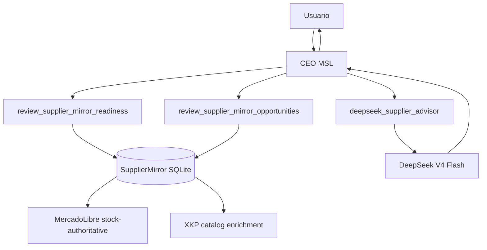

# Informe: integración CEO + Supplier Mirror + DeepSeek cache

Fecha: 2026-07-08  
Repositorio: `riquelmechile/Msl`  
Estado recomendado: arquitectura lista para wiring mínimo, no exponer agentes al usuario.

## Resumen ejecutivo

La mejor implementación para MSL no es agregar otro agente visible. La arquitectura correcta es mantener una sola interfaz humana: el CEO. El usuario habla con el CEO, el CEO consulta y coordina internamente Supplier Mirror, Jinpeng/XKP, publicaciones, precios, stock, memoria Cortex, workers y modelos.

La integración recomendada es conectar Supplier Mirror y un advisor DeepSeek como herramientas internas del CEO. Esto mantiene la experiencia de “empresa agente”: el CEO recibe la instrucción, revisa evidencia, consulta capacidades internas, consolida la decisión y responde con una recomendación ejecutiva. Nada de seleccionar workers, nada de hablar con el agente proveedor y nada de exponer subagentes.

El mayor valor de DeepSeek está en usar su context caching con prompts estables. La estrategia no debe ser “desarrollar mucho más”, sino ordenar el sistema para que el CEO reutilice bloques estables de instrucciones, políticas, schemas, glosario y herramientas. Luego solo cambia el sufijo variable: snapshot del proveedor, evidencia actual, item, stock, pregunta o decisión requerida. Así se aprovecha el cache, se reduce costo y se mejora consistencia.

La conclusión técnica es: MSL ya tiene una base suficientemente cercana. El gap principal no es conceptual, sino de wiring runtime y observabilidad. Falta inyectar `supplierMirrorStore` en los entrypoints reales del CEO, especialmente `/api/chat` y Telegram/bot, y sumar una herramienta interna `deepseek_supplier_advisor` optimizada para cache, JSON y logs de uso.

## Principio de producto obligatorio

El usuario no debe comunicarse con agentes internos.

```text
Usuario
  ↓
CEO MSL
  ↓↓↓↓↓↓↓
Supplier Mirror / Jinpeng / XKP
Publicaciones
Precios
Stock
Reclamos
MercadoLibre
Cortex / Memoria
DeepSeek
Workers internos
```

La respuesta hacia el usuario siempre debe volver como CEO:

```text
CEO: Revisé proveedor, stock, evidencia, precio y oportunidad.
Mi recomendación es publicar en Maustian con margen x2.5, pero necesito tu “dale” antes de ejecutar.
```

Lo que no debe pasar:

```text
Habla con el agente proveedor.
Escoge qué worker usar.
Ejecuta /agent supplier.
Selecciona un subagente.
```

El CEO puede usar herramientas internas, pero nunca debe convertirlas en interfaz de usuario.

## Estado actual del proyecto según inspección previa

Bajo la inspección previa del repositorio, Supplier Mirror está bien encaminado como subsistema. El diseño ya separa fuentes, autoridad de stock, enriquecimiento de catálogo, ledger, readiness, políticas y propuestas. El problema principal es que el módulo existe, pero todavía no parece estar completamente cableado en los entrypoints reales del CEO.

### Lo que ya está bien encaminado

- Existe dominio de Supplier Mirror con conceptos de proveedor, snapshots, observaciones de stock, target policies, ledger, notification events y learned fallback policies.
- Jinpeng aparece como proveedor real/canónico, mientras XKP funciona como enriquecimiento de catálogo.
- MercadoLibre debe mantenerse como fuente stock-authoritative.
- XKP no debe sobreescribir stock de MercadoLibre; debe aportar fotos, título, specs, categoría y contexto.
- El dry-run de Jinpeng/XKP es seguro y no ejecuta mutaciones externas.
- El worker está deshabilitado por defecto y requiere gates explícitos.
- Las herramientas actuales de Supplier Mirror están pensadas para revisión/propuesta, no para mutar sin aprobación.
- El CEO puede registrar herramientas internas en `createAgentLoop` si se le entrega `supplierMirrorStore`.

### Gap principal

El gap más importante es runtime wiring:

- `createAgentLoop` acepta o puede aceptar `supplierMirrorStore`.
- Pero `/api/chat` y Telegram/bot deben instanciar e inyectar ese store.
- Sin ese wiring, el CEO sabe conceptualmente que Supplier Mirror existe, pero no puede usarlo como capacidad operacional estable en la conversación real.

### Diagnóstico por capa

| Capa | Estado | Lectura |
|---|---:|---|
| Dominio Supplier Mirror | Alto | El modelo parece cohesionado. |
| Seguridad / gates | Alto | El diseño parte cerrado y read-only. |
| UX CEO-only | Alto | Calza con la visión de empresa agente. |
| Runtime web | Medio/Bajo | Falta inyección clara del store. |
| Runtime Telegram | Medio/Bajo | Falta inyección clara del store. |
| DeepSeek cache | Medio | Hay oportunidad grande, falta adapter/observabilidad. |
| Observabilidad | Medio/Bajo | Faltan logs claros de cache hit/miss y decisiones. |

## Implementación recomendada

La implementación recomendada debe ser incremental y de bajo riesgo:

1. Crear un runtime compartido para Supplier Mirror.
2. Inyectar `supplierMirrorStore` al CEO loop en web.
3. Inyectar `supplierMirrorStore` al CEO loop en Telegram/bot.
4. Crear herramienta interna `deepseek_supplier_advisor`.
5. Agregar logs de uso y cache.
6. Mantener workers y mutaciones apagados hasta aprobación explícita.

## Patch 1: runtime compartido de Supplier Mirror

Objetivo: no duplicar apertura de SQLite en cada entrypoint y dejar un punto único para activar WAL, busy timeout y cierre limpio.

Archivo sugerido:

```text
packages/runtime/src/supplierMirrorRuntime.ts
```

Alternativa si no existe paquete runtime:

```text
packages/agent/src/runtime/supplierMirrorRuntime.ts
```

Código base sugerido, ajustando imports al repo real:

```ts
import { mkdirSync } from "node:fs";
import { dirname, resolve } from "node:path";
import Database from "better-sqlite3";
import { createSqliteSupplierMirrorStore } from "@msl/memory";
import type { SupplierMirrorStore } from "@msl/domain";

export interface SupplierMirrorRuntime {
  dbPath: string;
  store: SupplierMirrorStore;
  close: () => void;
}

let singleton: SupplierMirrorRuntime | undefined;

export function getSupplierMirrorRuntimeFromEnv(
  env: NodeJS.ProcessEnv = process.env,
): SupplierMirrorRuntime | undefined {
  if (singleton) return singleton;

  const rawPath = env.MSL_SUPPLIER_MIRROR_DB_PATH?.trim();
  if (!rawPath) return undefined;

  const dbPath = resolve(rawPath);
  mkdirSync(dirname(dbPath), { recursive: true });

  const db = new Database(dbPath);
  db.pragma("journal_mode = WAL");
  db.pragma("busy_timeout = 5000");

  const store = createSqliteSupplierMirrorStore(db);

  singleton = {
    dbPath,
    store,
    close: () => {
      try {
        db.close();
      } finally {
        singleton = undefined;
      }
    },
  };

  return singleton;
}
```

Notas:

- Si `MSL_SUPPLIER_MIRROR_DB_PATH` no existe, retorna `undefined` y el CEO sigue funcionando sin Supplier Mirror.
- WAL es conveniente si web y bot están en la misma máquina.
- `busy_timeout` evita fallas por locks cortos.
- No abrir una DB nueva por request.
- No guardar secretos en SQLite.

## Patch 2: wiring en `/api/chat`

Objetivo: que el CEO web tenga acceso interno a Supplier Mirror.

Patrón sugerido:

```ts
import { getSupplierMirrorRuntimeFromEnv } from "@msl/runtime/supplierMirrorRuntime";

const supplierMirrorRuntime = getSupplierMirrorRuntimeFromEnv();

const agentLoop = createAgentLoop({
  systemPrompt,
  mockClient,
  sellerId,
  laneId: "ceo",
  tools,
  store,
  autonomyEngine,
  supplierMirrorStore: supplierMirrorRuntime?.store,
});
```

Reglas:

- No exponer `supplierMirrorStore` como comando del usuario.
- No agregar selector de worker.
- No permitir que el usuario elija agente.
- El CEO decide cuándo consultar la herramienta interna.
- Si no hay store, el CEO debe responder que la capacidad proveedor no está conectada, no inventar datos.

## Patch 3: wiring en Telegram/bot

Objetivo: que Telegram use el mismo principio CEO-only.

Patrón sugerido:

```ts
import { getSupplierMirrorRuntimeFromEnv } from "@msl/runtime/supplierMirrorRuntime";

const supplierMirrorRuntime = getSupplierMirrorRuntimeFromEnv(env);

const agentConfig = {
  systemPrompt,
  store,
  autonomyEngine,
  tools,
  supplierMirrorStore: supplierMirrorRuntime?.store,
};
```

En shutdown:

```ts
for (const signal of ["SIGINT", "SIGTERM"] as const) {
  process.on(signal, () => {
    supplierMirrorRuntime?.close();
    process.exit(0);
  });
}
```

Reglas:

- El bot sigue siendo CEO-only.
- No se crean comandos `/proveedor`, `/worker`, `/xkp` como interfaz principal.
- Si se agregan comandos técnicos, deben ser debug/admin-only, no UX normal.

## Patch 4: herramienta interna DeepSeek Advisor

Objetivo: aumentar inteligencia sin crear otro agente visible.

Nombre sugerido:

```text
deepseek_supplier_advisor
```

Rol:

- Analizar evidencia ya obtenida por Supplier Mirror.
- Proponer oportunidades, riesgos, anomalías y próximos pasos.
- Devolver JSON validado.
- No publicar.
- No pausar.
- No repricing automático.
- No ejecutar mutaciones externas.

Interfaz sugerida:

```ts
export interface SupplierEvidencePacket {
  supplierId: string;
  itemId?: string;
  snapshotDigest: string;
  evidenceJson: unknown;
  policyVersion: string;
  promptVersion: string;
}

export interface SupplierDecision {
  summary: string;
  confidence: "low" | "medium" | "high";
  actions: Array<{
    kind: "publish" | "pause" | "review" | "reprice" | "wait";
    reason: string;
    itemId?: string;
  }>;
  anomalies: string[];
  requiresCeoApproval: true;
}
```

Ejemplo de adapter:

```ts
import OpenAI from "openai";

export function createDeepSeekClient() {
  return new OpenAI({
    apiKey: process.env.DEEPSEEK_API_KEY,
    baseURL: process.env.DEEPSEEK_BASE_URL ?? "https://api.deepseek.com",
  });
}

export async function analyzeSupplierWithDeepSeek(
  packet: SupplierEvidencePacket,
): Promise<SupplierDecision> {
  const client = createDeepSeekClient();

  const response = await client.chat.completions.create({
    model: process.env.DEEPSEEK_MODEL ?? "deepseek-v4-flash",
    messages: [
      {
        role: "system",
        content: buildStableSupplierAdvisorSystemPrompt(packet.promptVersion),
      },
      {
        role: "system",
        content: buildStableSupplierPolicyBlock(packet.policyVersion),
      },
      {
        role: "user",
        content: JSON.stringify({
          task: "analyze_supplier_snapshot",
          supplierId: packet.supplierId,
          itemId: packet.itemId ?? null,
          snapshotDigest: packet.snapshotDigest,
          evidence: packet.evidenceJson,
        }),
      },
    ],
    response_format: { type: "json_object" },
    extra_body: {
      user_id: buildDeepSeekUserId(packet.supplierId),
    },
  });

  await logDeepSeekUsage({
    model: process.env.DEEPSEEK_MODEL ?? "deepseek-v4-flash",
    supplierId: packet.supplierId,
    promptTokens: response.usage?.prompt_tokens ?? 0,
    promptCacheHitTokens: response.usage?.prompt_cache_hit_tokens ?? 0,
    promptCacheMissTokens: response.usage?.prompt_cache_miss_tokens ?? 0,
    completionTokens: response.usage?.completion_tokens ?? 0,
  });

  const raw = response.choices[0]?.message?.content ?? "{}";
  return validateSupplierDecision(JSON.parse(raw));
}
```

## Estrategia DeepSeek cache

DeepSeek context caching funciona mejor cuando se repite el mismo prefijo desde el token inicial. Por eso el prompt debe separarse en dos partes.

### Prefijo estable

Debe cambiar poco y mantenerse siempre en el mismo orden:

- Rol interno del CEO.
- Regla de UX: usuario habla solo con CEO.
- Políticas de seguridad.
- Glosario de autoridad de evidencia.
- Reglas MercadoLibre vs XKP.
- Políticas de margen Maustian/Plasticov.
- Schema JSON de respuesta.
- Lista de herramientas internas.
- Reglas de aprobación humana.

### Sufijo variable

Cambia por consulta:

- Proveedor.
- Item.
- Snapshot actual.
- Diferencias desde último snapshot.
- Pregunta del CEO.
- Contexto puntual del usuario.

### Regla práctica

No meter timestamps innecesarios, IDs aleatorios ni texto reordenado en el prefijo. Eso rompe cache.

Bien:

```text
[SYSTEM ESTABLE v1]
[POLICY ESTABLE v1]
[JSON SCHEMA ESTABLE v1]
[INPUT VARIABLE]
```

Mal:

```text
[Timestamp dinámico]
[Texto generado distinto cada vez]
[Policy mezclada con evidencia]
[Schema reordenado]
[Input variable]
```

## Cache local complementario

DeepSeek ya hace context caching, pero conviene agregar cache local por digest para evitar llamadas iguales.

Tabla sugerida:

```sql
CREATE TABLE IF NOT EXISTS deepseek_analysis_cache (
  id TEXT PRIMARY KEY,
  task_kind TEXT NOT NULL,
  supplier_id TEXT NOT NULL,
  item_id TEXT,
  input_digest TEXT NOT NULL,
  prompt_version TEXT NOT NULL,
  policy_version TEXT NOT NULL,
  model TEXT NOT NULL,
  response_json TEXT NOT NULL,
  created_at TEXT NOT NULL,
  expires_at TEXT NOT NULL
);
```

Log de uso:

```sql
CREATE TABLE IF NOT EXISTS deepseek_usage_log (
  id TEXT PRIMARY KEY,
  model TEXT NOT NULL,
  supplier_id TEXT,
  item_id TEXT,
  task_kind TEXT NOT NULL,
  prompt_tokens INTEGER NOT NULL,
  prompt_cache_hit_tokens INTEGER NOT NULL,
  prompt_cache_miss_tokens INTEGER NOT NULL,
  completion_tokens INTEGER NOT NULL,
  latency_ms INTEGER,
  created_at TEXT NOT NULL
);
```

Invalidar cache cuando:

- Cambia snapshot.
- Cambia item.
- Cambia policy version.
- Cambia prompt version.
- Cambia modelo.
- Cambia autoridad de evidencia.
- Vence TTL.

TTL recomendado:

| Tipo de análisis | TTL |
|---|---:|
| Readiness proveedor | 15-60 min |
| Oportunidades catálogo | 6-24 h |
| Anomalías stock | 5-15 min |
| Descripción/título sugerido | 24 h o hasta cambio de snapshot |
| Auditoría de políticas | 24 h |

## Uso de modelos

Recomendación inicial:

```text
DEEPSEEK_MODEL=deepseek-v4-flash
```

Uso recomendado:

| Modelo | Uso |
|---|---|
| `deepseek-v4-flash` | Default para análisis frecuente, proveedor, catálogo, readiness, JSON. |
| `deepseek-v4-pro` | Solo para decisiones complejas, auditorías grandes o resolución de conflictos. |

No construir sobre aliases legacy si la documentación actual ya indica modelos V4 nuevos. Mantener nombres de modelo en env para poder rotar sin tocar código.

## Variables de entorno recomendadas

```bash
# Supplier Mirror
MSL_SUPPLIER_MIRROR_DB_PATH=.data/supplier-mirror.sqlite
MSL_SUPPLIER_MIRROR_WORKER_ENABLED=false

# Jinpeng / XKP
MSL_JINPENG_ML_SELLER_ID=123456789
MSL_JINPENG_XKP_URL=https://www.xkp.cl/products
MSL_MAUSTIAN_SELLER_ID=maustian
MSL_PLASTICOV_SELLER_ID=plasticov

# MercadoLibre
MELI_ACCESS_TOKEN=***
MELI_CLIENT_ID=***
MELI_CLIENT_SECRET=***

# DeepSeek
DEEPSEEK_API_KEY=***
DEEPSEEK_BASE_URL=https://api.deepseek.com
DEEPSEEK_MODEL=deepseek-v4-flash
DEEPSEEK_USER_ID_PREFIX=ceo_supplier_mirror
```

## Flujo operacional recomendado



Ejemplo de interacción esperada:

```text
Usuario: CEO, revisa Jinpeng/XKP y dime qué conviene publicar.

CEO:
Revisé el proveedor internamente.
Hay 12 productos con evidencia suficiente, 4 con fotos buenas desde XKP y stock confiable desde MercadoLibre.
Mi recomendación es partir con 3 publicaciones en Maustian usando margen x2.5.
No ejecuté ninguna publicación.
Necesito tu “dale” para preparar los borradores.
```

## Seguridad y gates

Reglas obligatorias:

- `MSL_SUPPLIER_MIRROR_WORKER_ENABLED=false` en primera fase.
- DeepSeek Advisor no muta nada.
- Supplier Mirror review tools no mutan nada.
- No publicar, pausar ni repricing sin aprobación explícita.
- El CEO debe decir qué revisó y qué no ejecutó.
- El usuario solo aprueba acciones con “dale” o equivalente explícito.
- XKP no tiene autoridad de stock.
- MercadoLibre es stock-authoritative.
- No guardar secretos en SQLite.
- `user_id` de DeepSeek no debe contener email, teléfono, RUT ni datos personales.

## Pruebas necesarias

### Unit tests

1. `getSupplierMirrorRuntimeFromEnv` retorna `undefined` sin env.
2. Crea carpeta de DB si no existe.
3. Activa WAL y busy timeout.
4. Retorna singleton.
5. Cierra DB sin dejar singleton colgado.
6. `createAgentLoop` recibe `supplierMirrorStore` cuando env está configurada.
7. CEO registra herramientas Supplier Mirror solo como internas.
8. DeepSeek Advisor devuelve JSON validado.
9. DeepSeek Advisor falla cerrado si no hay API key.
10. DeepSeek usage log guarda hit/miss tokens.

### Smoke tests

```bash
npm run supplier-mirror:jinpeng:dry-run
npm run typecheck
npm run test
npm run lint
npm run format:check
```

### Prompts de validación CEO

```text
CEO, revisa readiness de Jinpeng/XKP sin ejecutar nada.
CEO, dime oportunidades de publicación del proveedor.
CEO, detecta anomalías entre XKP y MercadoLibre.
CEO, prepara una recomendación de margen pero no publiques.
```

Resultado esperado:

- El CEO responde como CEO.
- No menciona que el usuario debe hablar con un agente interno.
- No expone workers.
- No muta datos externos.
- Pide aprobación antes de cualquier acción.

## Roadmap priorizado

### Fase 1 — Wiring mínimo seguro

- Crear runtime compartido de Supplier Mirror.
- Inyectar store en `/api/chat`.
- Inyectar store en Telegram/bot.
- Mantener worker apagado.
- Probar dry-run.

Resultado: el CEO puede revisar Supplier Mirror internamente.

### Fase 2 — DeepSeek Advisor interno

- Crear adapter DeepSeek OpenAI-compatible.
- Crear tool interno `deepseek_supplier_advisor`.
- Usar `deepseek-v4-flash` por defecto.
- Forzar JSON output.
- Validar schema.

Resultado: el CEO se vuelve más inteligente sin crear otra interfaz.

### Fase 3 — Cache y costos

- Crear cache local por digest.
- Crear usage log.
- Medir cache hit ratio.
- Ajustar prompt para maximizar prefijo estable.

Resultado: menor costo, menor latencia y mejor consistencia.

### Fase 4 — Autonomía controlada

- Mantener propuestas read-only.
- Agregar preparación de borradores.
- Requerir “dale” para publicar/pausar/repricing.
- Ledger de decisión y evidencia.

Resultado: empresa agente operando con control humano.

### Fase 5 — Worker live limitado

- Habilitar worker solo para lectura/sync.
- Mantener mutaciones externas apagadas.
- Habilitar acciones reales una por una con gates.

Resultado: proveedor sincronizado sin perder control.

## Riesgos principales

| Riesgo | Impacto | Mitigación |
|---|---:|---|
| Exponer subagentes al usuario | Alto | CEO-only UX estricta. |
| XKP usado como stock authority | Alto | Regla fija: XKP solo enrichment. |
| Mutaciones sin aprobación | Alto | Gates + ledger + “dale”. |
| SQLite locks | Medio | Singleton, WAL, busy timeout, cierre limpio. |
| Cache hit bajo | Medio | Prefijos estables y logs hit/miss. |
| JSON inválido de DeepSeek | Medio | Schema validation y fallback seguro. |
| Costos altos por prompts variables | Medio | Separar prefijo estable/sufijo variable. |
| Secretos en DB/logs | Alto | Redacción y no persistir secretos. |

## Decisión recomendada

Implementar primero wiring + advisor, no un subagente visible.

La mejor forma de conectarle “un agente” al proyecto es no crear una conversación nueva, sino convertirlo en una capacidad interna del CEO:

```text
CEO
 ├─ review_supplier_mirror_readiness
 ├─ review_supplier_mirror_opportunities
 ├─ deepseek_supplier_advisor
 ├─ Cortex memory
 ├─ ledger
 └─ approval gates
```

El usuario solo ve:

```text
CEO: revisé, comparé, inferí y recomiendo esto. ¿Autorizas con “dale”?
```

## Checklist antes de considerar listo

- [ ] `MSL_SUPPLIER_MIRROR_DB_PATH` configurado.
- [ ] Runtime compartido creado.
- [ ] Store inyectado en web.
- [ ] Store inyectado en Telegram/bot.
- [ ] Worker apagado por defecto.
- [ ] Dry-run Jinpeng/XKP exitoso.
- [ ] CEO puede revisar readiness.
- [ ] CEO puede revisar oportunidades.
- [ ] DeepSeek Advisor devuelve JSON validado.
- [ ] Logs guardan `prompt_cache_hit_tokens` y `prompt_cache_miss_tokens`.
- [ ] No se exponen subagentes al usuario.
- [ ] No hay mutaciones externas sin “dale”.

## Fuentes externas consultadas

- DeepSeek API Docs — Context Caching: `https://api-docs.deepseek.com/guides/kv_cache`
- DeepSeek API Docs — Create Chat Completion: `https://api-docs.deepseek.com/api/create-chat-completion`
- DeepSeek API Docs — JSON Output: `https://api-docs.deepseek.com/guides/json_mode`
- DeepSeek API Docs — Tool Calls: `https://api-docs.deepseek.com/guides/tool_calls`
- DeepSeek API Docs — Thinking Mode: `https://api-docs.deepseek.com/guides/thinking_mode`
- DeepSeek API Docs — Rate Limit & Isolation: `https://api-docs.deepseek.com/quick_start/rate_limit`
- DeepSeek API Docs — Models & Pricing: `https://api-docs.deepseek.com/quick_start/pricing`
- SQLite — Write-Ahead Logging: `https://sqlite.org/wal.html`
- Node.js — File system docs: `https://nodejs.org/api/fs.html`

## Conclusión final

MSL no necesita más interfaces. Necesita que el CEO sea realmente el único frente de la empresa y que por dentro tenga mejores órganos: Supplier Mirror como memoria/proveedor operacional y DeepSeek como advisor cache-friendly.

La implementación correcta es mínima, segura y potente:

```text
Conectar SupplierMirrorStore al CEO.
Agregar DeepSeek Advisor interno.
Usar prefijos estables para cache.
Guardar métricas de hit/miss.
Mantener mutaciones apagadas hasta aprobación explícita.
```

Eso convierte el módulo proveedor en parte real de la empresa agente sin romper la visión original: usted habla con el CEO; el CEO coordina todo lo demás por dentro.